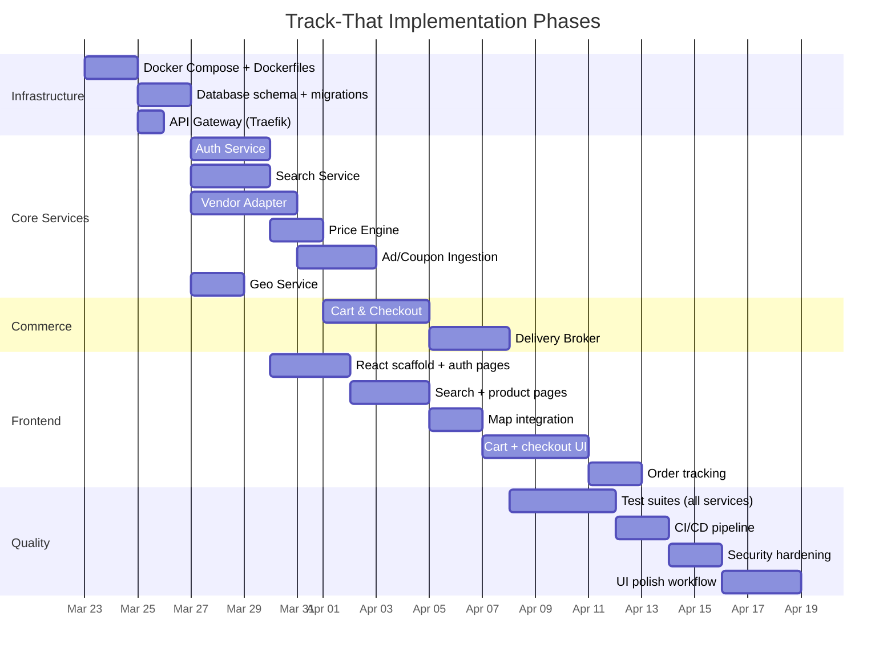

# Track-That: Project Outline

## Project Summary

Track-That is a multi-vendor local price comparison and shopping platform that aggregates product listings, prices, and promotions from nearby businesses, ranks them by a composite deal score (price, distance, freshness, rating, coupons), and lets users purchase items across multiple stores in a single checkout with integrated delivery brokering. The system runs as Dockerized microservices with a React SPA frontend, enforcing non-root runtime, encrypted communication, and PCI-compliant payment processing via Stripe.

---

## Directory & File Structure

```
track-that/
├── docker-compose.yml              # Dev orchestration (all services + data stores)
├── docker-compose.test.yml         # CI integration test orchestration
├── docker-compose.prod.yml         # Production overrides (resource limits, secrets)
├── .env.example                    # Template for environment variables (no secrets)
├── Makefile                        # Common commands: up, down, test, lint, migrate
├── CHANGELOG.md                    # Keep-a-changelog format
├── PRINCIPLES.md                   # Engineering principles reference
│
├── docs/
│   ├── TRACK_THAT_PLAN.md          # 15-phase master planning document
│   ├── PROJECT_OUTLINE.md          # This file
│   ├── architecture.mmd            # Full system architecture diagram (Mermaid)
│   └── adr/
│       ├── ADR-001-microservices-architecture.md
│       ├── ADR-002-payment-via-stripe.md
│       ├── ADR-003-non-root-container-runtime.md
│       ├── ADR-004-elasticsearch-for-search.md      # (future)
│       └── ADR-005-delivery-broker-abstraction.md   # (future)
│
├── prompts/
│   ├── CONCEPT_TO_CODE_QUESTIONNAIRE.md
│   └── EXECUTION_PLAN.md
│
├── gateway/
│   ├── Dockerfile                  # Traefik or Nginx config image
│   ├── traefik.yml                 # Static config: entrypoints, TLS, providers
│   ├── dynamic/
│   │   ├── routes.yml              # Path-based routing to services
│   │   ├── middlewares.yml         # Rate limiting, CORS, security headers
│   │   └── tls.yml                 # Certificate configuration
│   └── certs/                      # Dev self-signed certs (gitignored)
│
├── frontend/
│   ├── Dockerfile                  # Multi-stage: node build → nginx serve
│   ├── nginx.conf                  # SPA fallback, security headers, gzip
│   ├── package.json
│   ├── tsconfig.json
│   ├── vite.config.ts
│   ├── tailwind.config.ts
│   ├── index.html
│   ├── public/
│   │   └── favicon.svg
│   ├── src/
│   │   ├── main.tsx                # App entrypoint
│   │   ├── App.tsx                 # Router + auth provider
│   │   ├── router.tsx              # Route definitions
│   │   ├── api/
│   │   │   ├── client.ts           # Axios instance (interceptors, CSRF, request-id)
│   │   │   ├── auth.ts             # Auth API calls
│   │   │   ├── search.ts           # Search API calls
│   │   │   ├── cart.ts             # Cart API calls
│   │   │   ├── checkout.ts         # Checkout API calls
│   │   │   ├── delivery.ts         # Delivery API calls
│   │   │   ├── geo.ts              # Geo API calls
│   │   │   └── deals.ts            # Deals/coupons API calls
│   │   ├── components/
│   │   │   ├── layout/
│   │   │   │   ├── MainLayout.tsx
│   │   │   │   ├── AuthLayout.tsx
│   │   │   │   ├── TopNav.tsx
│   │   │   │   └── Footer.tsx
│   │   │   ├── search/
│   │   │   │   ├── SearchBar.tsx
│   │   │   │   ├── SearchResults.tsx
│   │   │   │   ├── ProductCard.tsx
│   │   │   │   ├── FilterSidebar.tsx
│   │   │   │   └── SimilarItemsSection.tsx
│   │   │   ├── product/
│   │   │   │   ├── ProductDetail.tsx
│   │   │   │   ├── PriceComparisonTable.tsx
│   │   │   │   └── AddToCartForm.tsx
│   │   │   ├── map/
│   │   │   │   ├── MapView.tsx
│   │   │   │   ├── StoreMarker.tsx
│   │   │   │   └── RadiusCircle.tsx
│   │   │   ├── cart/
│   │   │   │   ├── CartPage.tsx
│   │   │   │   ├── StoreGroupCard.tsx
│   │   │   │   ├── CartItemRow.tsx
│   │   │   │   └── FulfillmentSelector.tsx
│   │   │   ├── checkout/
│   │   │   │   ├── CheckoutPage.tsx
│   │   │   │   ├── PaymentForm.tsx  # Stripe Elements wrapper
│   │   │   │   ├── OrderReview.tsx
│   │   │   │   └── OrderConfirmation.tsx
│   │   │   ├── orders/
│   │   │   │   ├── OrdersPage.tsx
│   │   │   │   ├── OrderDetail.tsx
│   │   │   │   └── DeliveryTracker.tsx
│   │   │   ├── auth/
│   │   │   │   ├── LoginPage.tsx
│   │   │   │   ├── RegisterPage.tsx
│   │   │   │   └── ForgotPasswordPage.tsx
│   │   │   ├── profile/
│   │   │   │   ├── ProfilePage.tsx
│   │   │   │   └── SettingsPage.tsx
│   │   │   └── shared/
│   │   │       ├── LoadingSpinner.tsx
│   │   │       ├── ErrorBoundary.tsx
│   │   │       ├── EmptyState.tsx
│   │   │       ├── Pagination.tsx
│   │   │       ├── Toast.tsx
│   │   │       ├── Modal.tsx
│   │   │       └── Badge.tsx
│   │   ├── hooks/
│   │   │   ├── useAuth.ts
│   │   │   ├── useSearch.ts
│   │   │   ├── useCart.ts
│   │   │   ├── useGeo.ts
│   │   │   └── useDebounce.ts
│   │   ├── stores/                 # Zustand state stores
│   │   │   ├── authStore.ts
│   │   │   ├── cartStore.ts
│   │   │   └── geoStore.ts
│   │   ├── lib/
│   │   │   ├── validators.ts       # Zod schemas for forms
│   │   │   ├── formatters.ts       # Currency, distance, date formatters
│   │   │   └── constants.ts        # API base URL, category enums
│   │   └── types/
│   │       ├── api.ts              # API response/request types
│   │       ├── product.ts
│   │       ├── store.ts
│   │       ├── cart.ts
│   │       ├── order.ts
│   │       └── user.ts
│   └── tests/
│       ├── components/             # Component unit tests (Vitest + Testing Library)
│       └── e2e/                    # Playwright E2E tests
│           ├── auth.spec.ts
│           ├── search.spec.ts
│           ├── cart-checkout.spec.ts
│           └── playwright.config.ts
│
├── services/
│   ├── auth/
│   │   ├── Dockerfile
│   │   ├── package.json
│   │   ├── tsconfig.json
│   │   └── src/
│   │       ├── index.ts            # Express app bootstrap
│   │       ├── config.ts           # Environment config (validated with Zod)
│   │       ├── routes/
│   │       │   ├── auth.routes.ts  # /register, /login, /logout, /refresh
│   │       │   └── user.routes.ts  # /users/me (GET, PATCH)
│   │       ├── controllers/
│   │       │   ├── auth.controller.ts
│   │       │   └── user.controller.ts
│   │       ├── services/
│   │       │   ├── auth.service.ts # bcrypt, JWT, refresh token logic
│   │       │   └── user.service.ts
│   │       ├── middleware/
│   │       │   ├── authenticate.ts # JWT verification
│   │       │   ├── rateLimit.ts    # Login rate limiter
│   │       │   ├── csrf.ts         # Double-submit CSRF
│   │       │   └── validate.ts     # Zod request validation
│   │       ├── models/             # Prisma or Drizzle model references
│   │       ├── utils/
│   │       │   └── logger.ts       # Structured logger (syslog 0-7)
│   │       └── tests/
│   │           ├── unit/
│   │           └── integration/
│   │
│   ├── search/
│   │   ├── Dockerfile
│   │   ├── package.json
│   │   └── src/
│   │       ├── index.ts
│   │       ├── config.ts
│   │       ├── routes/
│   │       │   └── search.routes.ts  # /search, /search/suggest, /products/:id, /categories
│   │       ├── controllers/
│   │       │   └── search.controller.ts
│   │       ├── services/
│   │       │   ├── search.service.ts   # Query normalization, ES queries
│   │       │   ├── suggest.service.ts  # Autocomplete
│   │       │   └── dictionary.ts       # Common-word validation
│   │       ├── elasticsearch/
│   │       │   ├── client.ts           # ES client init
│   │       │   ├── indices.ts          # Index creation + mappings
│   │       │   └── analyzers.ts        # Custom product_analyzer, synonyms
│   │       ├── middleware/
│   │       ├── utils/
│   │       │   └── logger.ts
│   │       └── tests/
│   │
│   ├── price-engine/
│   │   ├── Dockerfile
│   │   ├── package.json
│   │   └── src/
│   │       ├── index.ts
│   │       ├── routes/
│   │       │   └── price.routes.ts   # /prices/compare, /prices/best-deals, /prices/history
│   │       ├── services/
│   │       │   ├── scoring.service.ts    # Deal scoring algorithm
│   │       │   ├── coupon.service.ts     # Coupon application logic
│   │       │   ├── staleness.service.ts  # Price freshness tracking
│   │       │   └── fallback.service.ts   # Similar items logic
│   │       ├── cache/
│   │       │   └── redis.ts              # Price cache layer
│   │       ├── utils/
│   │       │   └── logger.ts
│   │       └── tests/
│   │
│   ├── cart-checkout/
│   │   ├── Dockerfile
│   │   ├── package.json
│   │   └── src/
│   │       ├── index.ts
│   │       ├── routes/
│   │       │   ├── cart.routes.ts       # /cart, /cart/items
│   │       │   ├── checkout.routes.ts   # /checkout/initiate, /fulfillment, /pay, /complete
│   │       │   └── order.routes.ts      # /orders, /orders/:id
│   │       ├── services/
│   │       │   ├── cart.service.ts       # Cart CRUD, store grouping
│   │       │   ├── checkout.service.ts   # Price lock, payment orchestration
│   │       │   ├── order.service.ts      # Order + sub-order creation
│   │       │   └── payment.service.ts    # Stripe PaymentIntent wrapper
│   │       ├── middleware/
│   │       ├── utils/
│   │       │   └── logger.ts
│   │       └── tests/
│   │
│   ├── delivery-broker/
│   │   ├── Dockerfile
│   │   ├── package.json
│   │   └── src/
│   │       ├── index.ts
│   │       ├── routes/
│   │       │   ├── delivery.routes.ts    # /delivery/quote, /delivery/:id/status
│   │       │   └── webhook.routes.ts     # /delivery/webhook/:provider
│   │       ├── services/
│   │       │   ├── broker.service.ts     # Provider selection by weight/type
│   │       │   ├── quote.service.ts      # Quote aggregation
│   │       │   └── tracking.service.ts   # Status management
│   │       ├── providers/
│   │       │   ├── provider.interface.ts # Common provider contract
│   │       │   ├── doordash.provider.ts  # DoorDash Drive adapter
│   │       │   ├── uber.provider.ts      # Uber Direct adapter
│   │       │   └── pickup.provider.ts    # In-store pickup (internal)
│   │       ├── security/
│   │       │   ├── hmac.ts               # Webhook HMAC verification
│   │       │   └── replay.ts             # Replay protection (timestamp + nonce)
│   │       ├── utils/
│   │       │   └── logger.ts
│   │       └── tests/
│   │
│   ├── vendor-adapter/
│   │   ├── Dockerfile
│   │   ├── package.json
│   │   └── src/
│   │       ├── index.ts
│   │       ├── scheduler/
│   │       │   └── cron.ts              # Scrape scheduling (BullMQ)
│   │       ├── adapters/
│   │       │   ├── adapter.interface.ts  # Common adapter contract
│   │       │   ├── web-scraper.ts        # Cheerio/Puppeteer scraper
│   │       │   ├── api-adapter.ts        # REST/GraphQL adapter
│   │       │   ├── feed-parser.ts        # RSS/Atom parser
│   │       │   └── csv-parser.ts         # CSV/spreadsheet adapter
│   │       ├── pipeline/
│   │       │   ├── normalizer.ts         # Product name/price normalization
│   │       │   ├── deduplicator.ts       # Canonical product matching
│   │       │   └── writer.ts             # PostgreSQL + Elasticsearch writer
│   │       ├── utils/
│   │       │   ├── logger.ts
│   │       │   └── robots.ts             # robots.txt parser/checker
│   │       └── tests/
│   │
│   ├── ads-ingestion/
│   │   ├── Dockerfile
│   │   ├── package.json
│   │   └── src/
│   │       ├── index.ts
│   │       ├── scheduler/
│   │       │   └── cron.ts              # Coupon/flyer scrape scheduling
│   │       ├── parsers/
│   │       │   ├── html-flyer.parser.ts  # CSS selector-based extraction
│   │       │   ├── image-flyer.parser.ts # OCR via Tesseract
│   │       │   ├── json-api.parser.ts    # Aggregator API parser
│   │       │   └── rss-feed.parser.ts    # RSS/Atom coupon feeds
│   │       ├── services/
│   │       │   ├── extraction.service.ts # Field extraction + confidence scoring
│   │       │   ├── validation.service.ts # Date/amount checks, dedup
│   │       │   └── matcher.service.ts    # Product catalog matching
│   │       ├── utils/
│   │       │   └── logger.ts
│   │       └── tests/
│   │
│   └── geo/
│       ├── Dockerfile
│       ├── package.json
│       └── src/
│           ├── index.ts
│           ├── routes/
│           │   └── geo.routes.ts        # /geo/stores, /geo/distance, /geo/geocode, /geo/reverse
│           ├── services/
│           │   ├── distance.service.ts   # Haversine formula
│           │   ├── geocode.service.ts    # Nominatim integration
│           │   └── proximity.service.ts  # Store-within-radius queries
│           ├── cache/
│           │   └── geohash.ts            # Geohash-bucketed distance cache
│           ├── utils/
│           │   └── logger.ts
│           └── tests/
│
├── database/
│   ├── prisma/
│   │   ├── schema.prisma             # Full schema (all domains)
│   │   ├── migrations/               # Additive-only migrations
│   │   └── seed.ts                   # Dev seed data
│   └── scripts/
│       ├── create-roles.sql          # Per-service PostgreSQL roles
│       └── create-schemas.sql        # auth, catalog, commerce, promotions, reviews
│
├── shared/
│   ├── logger/
│   │   ├── package.json
│   │   └── src/
│   │       ├── index.ts              # Shared structured logger
│   │       ├── severity.ts           # Syslog 0-7 enum
│   │       └── redaction.ts          # PII/token field redaction
│   ├── types/
│   │   ├── package.json
│   │   └── src/
│   │       ├── api.ts                # Shared API contract types
│   │       ├── events.ts             # Inter-service event types
│   │       └── errors.ts             # Standard error codes
│   └── middleware/
│       ├── package.json
│       └── src/
│           ├── authenticate.ts       # JWT validation (shared)
│           ├── requestId.ts          # X-Request-ID propagation
│           └── healthcheck.ts        # /healthz and /readyz handlers
│
├── scripts/
│   ├── dev-setup.sh                  # One-command dev environment setup
│   ├── generate-certs.sh             # Self-signed TLS for dev
│   ├── verify-non-root.sh            # CI: verify all containers run as non-root
│   └── seed-stores.sh                # Load test store data
│
├── .github/
│   └── workflows/
│       ├── ci.yml                    # Lint → test → build → scan → E2E
│       └── deploy.yml                # Staging canary → promote → production
│
└── .gitignore
```

---

## Module Breakdown with Responsibilities

### Core Services

| Module | Port | Responsibility | Data Ownership | External Dependencies |
|--------|------|---------------|---------------|----------------------|
| **auth** | 3001 | User registration, login, JWT issuance, session management, password reset | `auth.*` schema (users, sessions, refresh_tokens) | None |
| **search** | 3002 | Full-text product search, autocomplete, query normalization, dictionary validation | None (reads `catalog.*` via ES) | Elasticsearch |
| **price-engine** | 3003 | Deal scoring, coupon application, price staleness tracking, similar-item fallback | None (reads `catalog.*` + `promotions.*`) | Redis (cache) |
| **cart-checkout** | 3004 | Cart CRUD, split-cart grouping, price lock, payment orchestration, order management | `commerce.*` schema (carts, orders) | Stripe API |
| **delivery-broker** | 3005 | Delivery provider selection, quote aggregation, dispatch, webhook ingestion, tracking | None (reads `commerce.*`) | DoorDash, Uber Direct |
| **ads-ingestion** | 3006 | Coupon/flyer scraping, OCR, extraction, confidence scoring, scheduling | `promotions.*` schema (coupons, flyer_sources) | Vendor websites |
| **vendor-adapter** | 3007 | Store product scraping, data normalization, deduplication, catalog maintenance | `catalog.*` schema (products, stores, store_products) | Vendor websites, review APIs |
| **geo** | 3008 | Geocoding, distance calculation, store proximity queries, reverse geocoding | None (reads `catalog.stores`) | OpenStreetMap (Nominatim) |

### Shared Libraries

| Library | Purpose |
|---------|---------|
| `shared/logger` | Uniform structured JSON logger enforcing syslog severity 0-7 with PII redaction |
| `shared/types` | TypeScript types shared across services (API contracts, events, error codes) |
| `shared/middleware` | JWT validation, request-ID propagation, health check handlers |

### Infrastructure

| Component | Technology | Purpose |
|-----------|-----------|---------|
| API Gateway | Traefik | TLS termination, path routing, rate limiting, CORS, security headers |
| Frontend Server | Nginx (in frontend container) | Serve SPA bundle, security headers, gzip |
| PostgreSQL 16 | Primary database | Transactional data, PostGIS geospatial |
| Elasticsearch 8 | Search index | Full-text search, geo-queries, autocomplete |
| Redis 7 | Cache + queue | Price/distance caching, rate limiting, BullMQ job queue |

---

## Implementation Phases Mapped to Execution Plan

Each phase corresponds to a future prompt turn. Dependencies flow left-to-right; phases within a column can be parallelized.



### Phase-to-Turn Mapping

| Phase | Turn | Deliverable | Dependencies |
|-------|------|-------------|-------------|
| Infrastructure | 2 | `docker-compose.yml`, all Dockerfiles, `Makefile` | None |
| Database | 3 | Prisma schema, migrations, seed data, per-service roles | Infrastructure |
| Auth Service | 4 | Full auth service with JWT, refresh, rate limiting | Database |
| Search Service | 5 | Elasticsearch integration, query pipeline, autocomplete | Database |
| Vendor Adapter | 6 | Scraper framework, first adapter plugin, normalizer | Database |
| Price Engine | 7 | Scoring algorithm, coupon application, caching | Search, Vendor |
| Cart & Checkout | 8 | Split-cart, Stripe integration, order creation | Price Engine |
| Delivery Broker | 9 | Provider adapters, webhook handlers, tracking | Cart |
| Ad/Coupon Pipeline | 10 | Ingestion workers, parsers, OCR, scheduling | Vendor |
| Geo Service | 11 | Haversine, Nominatim, Leaflet map components | Database |
| Frontend Core | 12 | React scaffold, routing, auth pages, layout | Auth Service |
| Frontend Search | 13 | Search UI, product detail, map view | Search, Geo |
| Frontend Commerce | 14 | Cart UI, checkout flow, Stripe Elements, orders | Cart, Delivery |
| Testing | 15 | Unit + integration + E2E suites for all services | All services |
| CI/CD | 16 | GitHub Actions, container scanning, non-root validation | Testing |
| Security Hardening | 17 | CSP headers, WAF rules, CSRF enforcement, audit | CI/CD |
| UI Polish | 18 | audit → normalize → distill → bolder → colorize → animate → delight → quieter → extract → harden → polish | Security |

---

## Key Interfaces & Contracts

### API Contract: Search

```typescript
// GET /api/v1/search?q=organic+apples&lat=33.45&lng=-112.07&radius=15&category=grocery&page=1
interface SearchResponse {
  query: string;
  total_results: number;
  results: {
    product: {
      id: string;
      name: string;
      category: string;
      brand: string;
      image_url: string;
      description: string;
    };
    best_price: {
      store_name: string;
      price: number;
      distance_miles: number;
      on_sale: boolean;
      coupon_available: boolean;
    };
    listings: {
      store_id: string;
      store_name: string;
      price: number;
      original_price: number;
      distance_miles: number;
      store_rating: number;
    }[];
  }[];
  similar_items: { product: Product; best_price: BestPrice }[];
  search_metadata: {
    normalized_query: string;
    fuzzy_applied: boolean;
    response_time_ms: number;
  };
}
```

### API Contract: Cart

```typescript
// GET /api/v1/cart
interface CartResponse {
  id: string;
  status: "empty" | "active" | "checkout" | "payment_pending";
  store_groups: {
    store: { id: string; name: string; address: string; distance_miles: number };
    items: {
      id: string;
      product_name: string;
      quantity: number;
      unit_price: number;
      applied_coupon?: { code: string; discount: number };
      image_url: string;
    }[];
    fulfillment: "pickup" | "delivery" | null;
    delivery_fee?: number;
    subtotal: number;
  }[];
  total: number;
  item_count: number;
}
```

### API Contract: Delivery Webhook (Inbound)

```typescript
// POST /api/v1/delivery/webhook/:provider
// Headers: X-Signature: HMAC-SHA256 signature
interface DeliveryWebhookPayload {
  event: "driver_assigned" | "pickup_complete" | "delivery_complete" | "delivery_failed" | "delivery_cancelled";
  delivery_id: string;
  provider_order_id: string;
  timestamp: string;
  driver?: { name: string; phone_last4: string; vehicle: string };
  eta_minutes?: number;
}
```

### Inter-Service Contract: Vendor Adapter → Elasticsearch

```typescript
// Indexed document shape
interface ProductDocument {
  product_id: string;
  canonical_name: string;
  category: string;
  subcategory: string;
  brand: string;
  description: string;
  store_listings: {
    store_id: string;
    store_name: string;
    current_price: number;
    on_sale: boolean;
    location: { lat: number; lon: number };
    last_updated: string;
  }[];
}
```

### Shared Logger Contract

```typescript
// Every service MUST use this interface
interface LogEntry {
  timestamp: string;       // ISO 8601
  severity: 0 | 1 | 2 | 3 | 4 | 5 | 6 | 7;  // Syslog only
  service: string;         // e.g., "auth-service"
  request_id: string;      // From X-Request-ID header
  user_id?: string;        // Authenticated user (never PII)
  action: string;          // e.g., "auth.login", "search.query"
  message: string;
  metadata?: Record<string, unknown>;  // No PII, tokens, or passwords
}
```

---

## Testing Strategy Summary

### Test Pyramid

| Level | Framework | Count Target | Gate | Focus |
|-------|----------|-------------|------|-------|
| **Unit** | Vitest | 500+ per service | Merge blocker | Business logic, scoring, normalization, validation |
| **Integration** | Vitest + TestContainers | 100+ per service | Merge blocker | API endpoints against real PostgreSQL/ES/Redis |
| **E2E** | Playwright | ~20 critical paths | Release blocker | Full user journeys (search → cart → checkout) |
| **Security** | Custom + OWASP ZAP | Per endpoint | Release blocker | Injection, CSRF, auth bypass, privilege escalation |
| **Performance** | k6 / Artillery | Per critical path | Release blocker | Budget validation (search <500ms p95, checkout <2s p95) |

### Critical E2E Scenarios

1. Register → login → search → view results → view product detail
2. Add items from 2 stores → view split cart → select fulfillment
3. Checkout → Stripe payment → order confirmation → view order
4. Search with no results → see similar items fallback
5. Search with misspelling → fuzzy match correction
6. Delivery tracking status updates via webhook simulation
7. Auth rate limiting (6th failed login blocked)
8. CSRF protection (request without token rejected)
9. Expired price handling (stale price warning displayed)
10. Non-root container verification (all images)

### CI Pipeline Checks (13 total)

| # | Check | Tool | Blocks |
|---|-------|------|--------|
| 1 | Lint | ESLint | Merge |
| 2 | Format | Prettier | Merge |
| 3 | Type check | `tsc --noEmit` | Merge |
| 4 | Unit tests | Vitest | Merge |
| 5 | Integration tests | Vitest + TestContainers | Merge |
| 6 | Dependency audit | `npm audit --audit-level=high` | Merge |
| 7 | Container scan | Trivy (HIGH/CRITICAL) | Merge |
| 8 | Secret scan | TruffleHog / GitLeaks | Merge |
| 9 | License check | license-checker | Merge |
| 10 | Migration safety | Prisma migrate diff | Merge |
| 11 | Non-root verify | `verify-non-root.sh` | Merge |
| 12 | Commit message | commitlint | Merge |
| 13 | E2E tests | Playwright | Release |

---

## Risk Areas & Mitigation

### High Risk

| # | Risk | Impact | Likelihood | Mitigation |
|---|------|--------|-----------|-----------|
| R1 | **Vendor site structure changes break scrapers** | Product data goes stale; search results degrade | High | Adapter plugin architecture allows per-store fixes without redeploying other services. Staleness tracking auto-excludes stale data. Health dashboard alerts on scrape failures within 1 hour. |
| R2 | **Legal challenges from scraping vendor sites** | Service disruption for affected stores | Medium | Respect robots.txt. Identify bot in User-Agent. Provide opt-out mechanism. Consult legal before each vendor onboarding. Prefer API integrations where available. |
| R3 | **Payment processing failures during multi-store checkout** | Revenue loss, user frustration | Medium | Single Stripe PaymentIntent for total amount (not per-store). Retry with exponential backoff. Stripe webhook reconciliation for edge cases. Full refund automation for partial failures. |
| R4 | **Delivery provider API outages** | Users cannot get items delivered | Medium | Multi-provider fallback (DoorDash → Uber → pickup). Circuit breaker pattern per provider. User-facing fallback to pickup option. Health dashboard tracks provider uptime. |

### Medium Risk

| # | Risk | Impact | Likelihood | Mitigation |
|---|------|--------|-----------|-----------|
| R5 | **Elasticsearch index corruption or lag** | Search degradation | Low | 30-second refresh interval. Daily snapshots. Reindex script in runbook. Fallback to PostgreSQL full-text search (degraded mode). |
| R6 | **Price data accuracy** — scraped prices may be wrong or outdated | User trust erosion | Medium | Confidence scoring on extraction. Freshness badges in UI (fresh/aging/stale). Auto-expire after 72 hours. Encourage stores to provide API feeds for accuracy. |
| R7 | **CSRF/XSS attacks on checkout flow** | Financial loss, data breach | Low (with mitigations) | Double-submit CSRF tokens on all state-changing endpoints. SameSite=Strict cookies. CSP headers. React auto-escaping. DOMPurify for any raw HTML. Stripe.js isolates card input in iframe. |
| R8 | **Microservice operational complexity** | Slower development, debugging difficulty | Medium | Structured logging with request ID propagation. Centralized dashboards in Grafana. Health check endpoints. Docker Compose for local dev simplicity. Clear service ownership matrix. |

### Low Risk (Monitor)

| # | Risk | Impact | Likelihood | Mitigation |
|---|------|--------|-----------|-----------|
| R9 | **Redis failure** | Degraded performance (no cache), rate limiting disabled | Low | Services fall back to direct DB queries. Rate limiting moves to gateway level. Redis RDB snapshots every 15 min for fast recovery. |
| R10 | **Docker image supply chain compromise** | Malicious code in production | Very Low | Pin all base image versions (SHA digests). Trivy scan in CI. No `latest` tags. Official images only. `npm audit` on every build. |
| R11 | **Geolocation privacy concerns** | User trust erosion, regulatory risk | Low | Session-only location by default. Explicit opt-in for saved location. No background tracking. No location sharing with vendors. Privacy policy documentation. |
