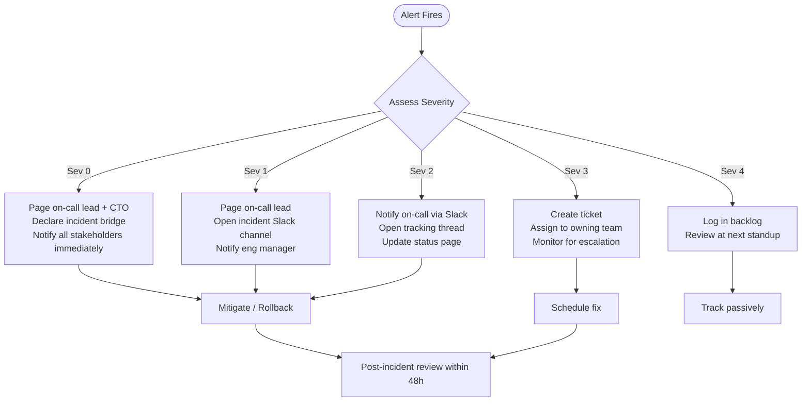
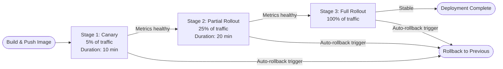
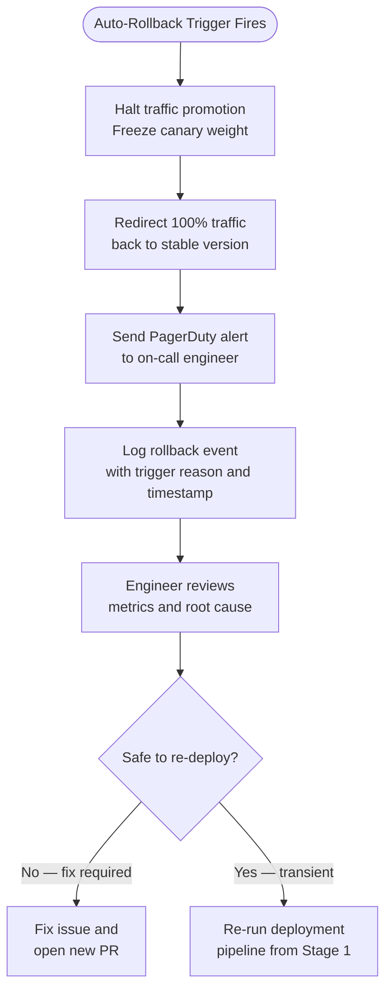
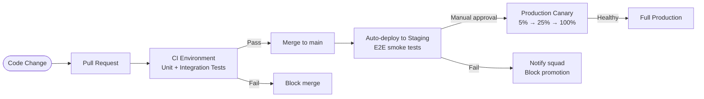

# Track-That Operational Runbooks

**Phase 15 — Production Readiness & Security Hardening**

This document contains all operational runbooks, incident severity classification, deployment strategy, environment strategy, and container security posture for the Track-That platform.

---

## Table of Contents

1. [Incident Severity Classification](#1-incident-severity-classification)
2. [Runbook 1 — Service Recovery](#2-runbook-1--service-recovery)
3. [Runbook 2 — Scrape Failure](#3-runbook-2--scrape-failure)
4. [Runbook 3 — Payment Outage](#4-runbook-3--payment-outage)
5. [Runbook 4 — Delivery Dispatch Failure](#5-runbook-4--delivery-dispatch-failure)
6. [Runbook 5 — Database Recovery](#6-runbook-5--database-recovery)
7. [Runbook 6 — Cache Failure](#7-runbook-6--cache-failure)
8. [Canary Deployment Strategy](#8-canary-deployment-strategy)
9. [Auto-Rollback Triggers](#9-auto-rollback-triggers)
10. [Environment Strategy](#10-environment-strategy)
11. [Container Runtime Security](#11-container-runtime-security)
12. [Feature Flags Reference](#12-feature-flags-reference)

---

## 1. Incident Severity Classification

All incidents are classified at the time of declaration. Severity determines response time, escalation path, and stakeholder communication cadence.

| Severity | Label | Response Time | Description | Example |
|----------|-------|---------------|-------------|---------|
| **Sev 0** | Critical — Total Outage | Immediate (< 5 min) | Complete platform unavailability. All users affected. Revenue at zero. | All services down; load balancer returning 502 to 100% of traffic |
| **Sev 1** | Critical — Major Degradation | < 15 min | Core user-facing flows broken for a significant user segment. Revenue severely impacted. | Payment processing down; checkout returns 500 for all users |
| **Sev 2** | High — Partial Degradation | < 30 min | A meaningful feature or integration is broken, but the platform remains partially usable. | Delivery dispatch failing for one provider (e.g., Uber Direct); fallback provider active |
| **Sev 3** | Medium — Minor Degradation | < 2 hours | Non-critical feature impaired. Most users unaffected. No immediate revenue impact. | Coupon confidence scoring returning stale results; auto-publish paused |
| **Sev 4** | Low — Informational | Next business day | Cosmetic issue, non-impactful error spike, or early warning signal. | Elevated p95 latency on geo-service still within SLO; scrape job slower than usual |

### Response Protocol by Severity



---

## 2. Runbook 1 — Service Recovery

### Trigger

One or more Track-That microservices are failing health checks, returning 5xx errors above threshold, or are completely unreachable.

### Severity

**Sev 0** (total service loss) or **Sev 1** (single critical service, e.g., auth-service or cart-checkout).

### Steps

1. **Identify the failing service.**
   Check Grafana dashboard `track-that/overview` for red health indicators. Confirm via:
   ```bash
   docker ps --filter "health=unhealthy"
   # or in Kubernetes:
   kubectl get pods -n track-that | grep -v Running
   ```

2. **Inspect container logs for root cause.**
   ```bash
   docker logs <container_name> --tail=200
   # or:
   kubectl logs -n track-that <pod_name> --previous
   ```
   Look for OOM kills, unhandled exceptions, missing environment variables, or failed dependency connections.

3. **Check dependency health (database, cache, external APIs).**
   Run readiness probe manually:
   ```bash
   curl -s http://localhost:<PORT>/healthz | jq .
   ```
   A healthy response returns `{"status":"ok"}`. Any `"degraded"` or `"error"` key indicates which dependency is failing.

4. **Attempt a rolling restart of the affected service.**
   ```bash
   docker-compose -f docker-compose.yml -f docker-compose.prod.yml up -d --no-deps --force-recreate <service_name>
   # or in Kubernetes:
   kubectl rollout restart deployment/<service_name> -n track-that
   ```

5. **If restart does not resolve the issue, roll back to previous image.**
   ```bash
   # Docker Compose — pin to previous tag
   TAG=<previous_tag> docker-compose -f docker-compose.yml -f docker-compose.prod.yml up -d <service_name>
   # Kubernetes
   kubectl rollout undo deployment/<service_name> -n track-that
   ```

6. **Verify resource limits are not being hit.**
   ```bash
   docker stats <container_name>
   # Check if memory usage is near the configured limit
   ```
   If container is memory-constrained, temporarily increase `memory` limit in `docker-compose.prod.yml` and redeploy.

7. **Check for cascading failures in upstream/downstream services.**
   Use the service dependency map in Grafana (`track-that/service-map`) to identify any circuit breakers that have opened as a result.

8. **Disable the feature flag for the failing service's feature if possible.**
   Use the admin feature flag API to isolate the blast radius:
   ```bash
   curl -X PUT /api/admin/flags/<flag_key> -d '{"value": false}' -H "Authorization: Bearer $ADMIN_TOKEN"
   ```

9. **Confirm service is healthy before closing incident.**
   Wait for at least 3 consecutive successful health check intervals (45 seconds at 15s interval).

### Escalation Path

- **L1**: On-call engineer — restart, rollback, flag toggle
- **L2**: Service owner / squad lead — root cause analysis, dependency investigation
- **L3**: Platform/infrastructure lead — resource limits, networking, container runtime issues
- **L4**: CTO — sustained Sev 0 beyond 15 minutes

### Resolution Verification

- [ ] All containers show `healthy` status for at least 2 minutes
- [ ] Error rate on the affected service drops below 0.1% in Grafana
- [ ] p99 latency returns to within SLO baseline
- [ ] No new error entries in structured logs for 5 minutes
- [ ] Incident bridge/channel closed with summary posted

---

## 3. Runbook 2 — Scrape Failure

### Trigger

The `ads-ingestion` service or `vendor-adapter` service fails to scrape one or more vendor ad feeds. Metrics: `scrape_failures_total` counter spikes, or scrape job has not completed within its scheduled window (typically 15 minutes late).

### Severity

**Sev 2** (single vendor) or **Sev 1** (majority of vendors failing, price data stale across platform).

### Steps

1. **Identify which vendors are failing.**
   Query the scrape failure metric:
   ```bash
   # Prometheus query
   sum by (vendor) (rate(scrape_failures_total[5m]))
   ```
   Cross-reference with the `ads-ingestion` structured logs filtered on `"action":"scrape.failed"`.

2. **Determine failure type.**
   Review log entries. Common categories:
   - `HTTP 403 / 429` — rate-limited or IP blocked by vendor
   - `HTTP 5xx` — vendor-side outage
   - `parse_error` — vendor changed their feed schema
   - `timeout` — vendor endpoint slow or unreachable
   - `schema_validation_failed` — new fields or removed required fields

3. **For rate-limit / IP block (403/429):**
   a. Immediately reduce scrape frequency via feature flag or scheduler config.
   b. Check if a backup IP/proxy is configured. If so, rotate.
   c. Contact vendor relationship manager if block persists > 1 hour.

4. **For vendor-side outage (5xx):**
   a. Verify outage via vendor status page.
   b. Enable exponential back-off in scrape scheduler (default is already configured; confirm it is active).
   c. Mark affected vendor prices as `stale` in Redis with TTL of 4 hours to avoid serving outdated data to users.
   d. Post update to internal status channel with estimated resolution.

5. **For schema change (parse_error / schema_validation_failed):**
   a. Pull the raw feed response and diff against the current schema definition in `vendor-adapter/src/schemas/`.
   b. Update the Zod schema to accommodate the change.
   c. Run unit tests: `pnpm test --filter=vendor-adapter`.
   d. Deploy patched `vendor-adapter` image via normal canary pipeline.

6. **For persistent timeout:**
   a. Check network egress from the container: `docker exec <container> curl -v <vendor_url>`.
   b. Review DNS resolution. Confirm the container can resolve the vendor hostname.
   c. If the issue is infrastructure-side, escalate to L3.

7. **Confirm fresh data is flowing.**
   ```bash
   # Check last successful scrape timestamp per vendor
   redis-cli HGETALL scrape:last_success
   ```
   Timestamps should be within the last scheduled window.

8. **Clear stale markers once fresh data is confirmed.**
   ```bash
   redis-cli DEL scrape:stale:<vendor_id>
   ```

### Escalation Path

- **L1**: On-call engineer — log review, feed inspection, flag adjustment
- **L2**: Ads ingestion team — schema update, vendor liaison
- **L3**: Infrastructure — IP/network/egress issues
- **Vendor contact**: Account manager for sustained blocks

### Resolution Verification

- [ ] `scrape_failures_total` rate returns to 0 for all previously failing vendors
- [ ] `scrape:last_success` timestamps updated within expected window
- [ ] No `stale` price markers active in Redis
- [ ] Grafana `ads-ingestion` dashboard shows green for all vendors
- [ ] Spot-check 3 products from each recovered vendor to confirm live prices are displayed

---

## 4. Runbook 3 — Payment Outage

### Trigger

The `cart-checkout` service is unable to process payments. Indicators: `payment_failures_total` spike, Stripe webhook delivery failures, or the `enable_payment` feature flag auto-disabled by circuit breaker.

### Severity

**Sev 1** (partial — one payment method failing) or **Sev 0** (total — all payment processing down).

### Steps

1. **Immediately assess blast radius.**
   Check what percentage of checkout attempts are failing:
   ```bash
   # Prometheus
   rate(payment_failures_total[2m]) / rate(checkout_attempts_total[2m])
   ```
   If failure rate > 50%, treat as Sev 0. Notify CTO and open incident bridge.

2. **Disable the payment flow via feature flag to prevent further failed charges.**
   ```bash
   curl -X PUT /api/admin/flags/enable_payment \
     -H "Authorization: Bearer $ADMIN_TOKEN" \
     -d '{"value": false, "updated_by": "oncall"}'
   ```
   This surfaces a "Payment temporarily unavailable" message to users rather than a hard 500.

3. **Check Stripe dashboard for outage.**
   Navigate to https://status.stripe.com. If Stripe is reporting an incident, follow Stripe's guidance and wait. Do not attempt code changes during an upstream outage.

4. **If Stripe is healthy, inspect `cart-checkout` logs.**
   Filter for `"action":"payment.failed"`:
   ```bash
   kubectl logs -n track-that deployment/cart-checkout | grep '"action":"payment.failed"' | tail -50
   ```
   Look for: invalid API key, webhook signature mismatch, idempotency key collisions, or network timeouts reaching Stripe's API.

5. **Verify environment secrets are intact.**
   ```bash
   kubectl get secret stripe-credentials -n track-that -o jsonpath='{.data.STRIPE_SECRET_KEY}' | base64 -d | wc -c
   ```
   The key should be non-empty and begin with `sk_live_` in production.

6. **Check for failed webhook deliveries in Stripe dashboard.**
   Stripe > Developers > Webhooks > Recent deliveries. If webhooks are failing, verify the `cart-checkout` `/webhooks/stripe` endpoint is reachable from the public internet.

7. **Test a manual charge using Stripe's test mode against staging to isolate code vs. configuration issues.**

8. **If a code regression caused the outage, roll back `cart-checkout`.**
   ```bash
   kubectl rollout undo deployment/cart-checkout -n track-that
   ```

9. **Re-enable payment flag once root cause is confirmed resolved.**
   ```bash
   curl -X PUT /api/admin/flags/enable_payment \
     -H "Authorization: Bearer $ADMIN_TOKEN" \
     -d '{"value": true, "updated_by": "oncall"}'
   ```

10. **Monitor for 10 minutes post-recovery.** Confirm successful end-to-end checkout with a real test transaction if possible.

### Escalation Path

- **L1**: On-call engineer — flag toggle, log review, Stripe status check
- **L2**: Cart/checkout squad lead — code investigation, secret verification
- **L3**: CTO / finance lead — sustained outage, customer communication, potential charge reconciliation
- **Stripe support**: For API-level issues confirmed on Stripe's side

### Resolution Verification

- [ ] `payment_failures_total` rate at 0 for 5 consecutive minutes
- [ ] `enable_payment` flag set back to `true`
- [ ] At least one successful end-to-end test checkout completed post-recovery
- [ ] Stripe dashboard shows no pending failed webhook deliveries
- [ ] Any customers who encountered errors during the outage window are identified for follow-up (check `orders` table for `status = 'payment_failed'` with timestamp in outage window)

---

## 5. Runbook 4 — Delivery Dispatch Failure

### Trigger

The `delivery-broker` service cannot dispatch delivery jobs to one or both active delivery providers (Uber Direct, DoorDash Drive). Indicators: `delivery_dispatch_failures_total` spike, orders stuck in `pending_dispatch` state.

### Severity

**Sev 2** (single provider failing, fallback active) or **Sev 1** (all providers failing, no deliveries being dispatched).

### Steps

1. **Identify which provider(s) are failing.**
   ```bash
   # Prometheus
   sum by (provider) (rate(delivery_dispatch_failures_total[5m]))
   ```

2. **Check provider status pages.**
   - Uber Direct: https://developer.uber.com/status
   - DoorDash Drive: https://status.doordash.com

3. **If a single provider is failing, disable it via feature flag to route all orders to the healthy provider.**
   ```bash
   # Disable Uber Direct
   curl -X PUT /api/admin/flags/enable_delivery_uber \
     -d '{"value": false, "updated_by": "oncall"}' \
     -H "Authorization: Bearer $ADMIN_TOKEN"

   # Disable DoorDash Drive
   curl -X PUT /api/admin/flags/enable_delivery_doordash \
     -d '{"value": false, "updated_by": "oncall"}' \
     -H "Authorization: Bearer $ADMIN_TOKEN"
   ```

4. **Inspect `delivery-broker` logs for failing provider.**
   Filter on `"provider":"uber"` or `"provider":"doordash"` with error level:
   ```bash
   kubectl logs -n track-that deployment/delivery-broker | \
     grep '"level":"error"' | grep '"provider"' | tail -30
   ```
   Common errors: `401 Unauthorized` (token expired), `422 Unprocessable Entity` (address/payload issue), `503 Service Unavailable` (provider outage).

5. **For `401 Unauthorized` — refresh provider API credentials.**
   Trigger the credential refresh job:
   ```bash
   kubectl create job --from=cronjob/delivery-token-refresh manual-token-refresh -n track-that
   ```

6. **For `422 Unprocessable Entity` — inspect the failing delivery payload.**
   Retrieve the raw payload from dead-letter queue or logs and validate against provider API docs. This may indicate a schema mismatch introduced by a recent deployment.

7. **For all-providers failure — check `delivery-broker` internal health.**
   ```bash
   curl -s http://delivery-broker:3005/healthz | jq .
   ```
   If the service itself is degraded, follow Runbook 1 for service recovery first.

8. **Reprocess orders stuck in `pending_dispatch`.**
   ```bash
   # Trigger requeue for stuck orders older than 5 minutes
   psql $DATABASE_URL -c "
     UPDATE orders
     SET status = 'dispatch_queued', updated_at = NOW()
     WHERE status = 'pending_dispatch'
       AND updated_at < NOW() - INTERVAL '5 minutes';
   "
   ```

9. **Re-enable disabled provider flag once provider is confirmed healthy.**

10. **Communicate to operations team about any orders that required manual intervention.**

### Escalation Path

- **L1**: On-call engineer — flag toggle, log inspection, credential refresh
- **L2**: Delivery integration squad — payload debugging, provider schema updates
- **L3**: Operations manager — manual order fulfillment escalation for time-sensitive orders
- **Provider support**: Uber Direct / DoorDash API support portals

### Resolution Verification

- [ ] `delivery_dispatch_failures_total` rate at 0 for both providers
- [ ] No orders remaining in `pending_dispatch` state beyond SLA (5 minutes)
- [ ] Both provider feature flags re-enabled
- [ ] Delivery confirmation webhooks being received for dispatched orders
- [ ] Operations team notified of any manually handled orders during the outage

---

## 6. Runbook 5 — Database Recovery

### Trigger

PostgreSQL primary is unreachable, replication lag exceeds threshold (> 60 seconds), disk usage exceeds 85%, or a corrupted table/index is detected. Indicators: services returning `"db_connection_failed"` in health checks, `db_query_duration_ms` p99 spiking above 5000ms.

### Severity

**Sev 0** (primary unreachable) or **Sev 1** (replication lag / disk pressure / index corruption).

### Steps

1. **Confirm database connectivity from application side.**
   ```bash
   kubectl exec -n track-that deployment/auth-service -- \
     node -e "const p=require('pg');const c=new p.Client({connectionString:process.env.DATABASE_URL});c.connect().then(()=>{console.log('ok');c.end()}).catch(e=>console.error(e.message))"
   ```

2. **Connect directly to PostgreSQL and check cluster status.**
   ```bash
   psql $DATABASE_URL -c "SELECT pg_is_in_recovery(), version();"
   # Check replication lag
   psql $DATABASE_URL -c "SELECT now() - pg_last_xact_replay_timestamp() AS replication_lag;"
   ```

3. **Check disk usage on the database host.**
   ```bash
   df -h /var/lib/postgresql
   ```
   If > 85%, immediately identify large tables/indexes:
   ```bash
   psql $DATABASE_URL -c "
     SELECT schemaname, tablename,
       pg_size_pretty(pg_total_relation_size(schemaname||'.'||tablename)) AS size
     FROM pg_tables
     ORDER BY pg_total_relation_size(schemaname||'.'||tablename) DESC
     LIMIT 10;"
   ```

4. **For primary unreachable — initiate failover to replica.**
   ```bash
   # Managed PostgreSQL (e.g., RDS, Neon, Supabase) — trigger failover via cloud console or CLI
   # AWS RDS:
   aws rds failover-db-cluster --db-cluster-identifier track-that-prod

   # Update DATABASE_URL secret in Kubernetes to point to replica endpoint
   kubectl create secret generic db-credentials \
     --from-literal=DATABASE_URL="$REPLICA_URL" \
     --dry-run=client -o yaml | kubectl apply -f -

   # Rolling restart all services to pick up new connection string
   kubectl rollout restart deployment -n track-that
   ```

5. **For replication lag > 60s — identify cause.**
   ```bash
   psql $DATABASE_URL -c "SELECT * FROM pg_stat_replication;"
   psql $DATABASE_URL -c "SELECT * FROM pg_stat_activity WHERE state = 'active' ORDER BY duration DESC LIMIT 10;"
   ```
   If a long-running query is blocking replication, terminate it:
   ```bash
   psql $DATABASE_URL -c "SELECT pg_terminate_backend(<pid>);"
   ```

6. **For disk pressure — free space immediately.**
   a. Run `VACUUM FULL` on the largest tables (during low-traffic window if possible).
   b. Archive and truncate old `audit_log` and `scrape_raw` tables if safe.
   c. Add disk capacity alert at 70% to catch earlier next time.

7. **For index corruption — rebuild the affected index.**
   ```bash
   psql $DATABASE_URL -c "REINDEX TABLE <table_name>;"
   ```
   If data corruption is suspected, restore from the most recent snapshot.

8. **Restore from backup if data loss has occurred.**
   ```bash
   # Identify the most recent clean backup
   aws s3 ls s3://track-that-db-backups/ | sort | tail -5

   # Restore (this will cause downtime — coordinate with stakeholders first)
   pg_restore -d $DATABASE_URL -Fc backup_<timestamp>.dump
   ```

9. **Run post-recovery integrity checks.**
   ```bash
   psql $DATABASE_URL -c "SELECT schemaname, tablename FROM pg_tables WHERE schemaname = 'public';"
   psql $DATABASE_URL -c "SELECT COUNT(*) FROM orders;"
   psql $DATABASE_URL -c "SELECT COUNT(*) FROM users;"
   ```

### Escalation Path

- **L1**: On-call engineer — connectivity checks, replication lag, query kill
- **L2**: Database administrator / platform lead — failover, disk management, restore
- **L3**: CTO + data lead — data loss scenarios, customer impact assessment
- **Cloud provider support**: For managed database platform issues

### Resolution Verification

- [ ] All services report `"db":"ok"` in `/healthz` response
- [ ] `pg_is_in_recovery()` returns `f` (false) on the primary
- [ ] Replication lag below 5 seconds
- [ ] Disk usage below 70%
- [ ] `db_query_duration_ms` p99 returned to baseline (< 200ms for common queries)
- [ ] Row counts in critical tables (`users`, `orders`, `products`) match pre-incident estimates

---

## 7. Runbook 6 — Cache Failure

### Trigger

Redis cluster is unreachable or returning errors. Indicators: `cache_miss_rate` > 95% (all misses, no cache), `redis_connection_errors_total` spiking, or services logging `"cache_error"` events.

### Severity

**Sev 2** (Redis unavailable but services falling back to database) or **Sev 1** (database overwhelmed due to cache failure causing cascading degradation).

### Steps

1. **Confirm Redis is unreachable.**
   ```bash
   redis-cli -h $REDIS_HOST -p $REDIS_PORT ping
   # Expected: PONG
   # If timeout or connection refused, Redis is down
   ```

2. **Check Redis service health.**
   ```bash
   docker inspect redis --format='{{.State.Health.Status}}'
   # or in Kubernetes:
   kubectl get pod -n track-that -l app=redis
   ```

3. **Inspect Redis logs for crash or OOM.**
   ```bash
   docker logs redis --tail=100
   # Look for: "Can't save in background: fork: Cannot allocate memory"
   # or: "MISCONF Redis is configured to save RDB snapshots"
   ```

4. **Attempt Redis restart.**
   ```bash
   docker-compose -f docker-compose.yml -f docker-compose.prod.yml restart redis
   # or:
   kubectl rollout restart statefulset/redis -n track-that
   ```

5. **If Redis restarts successfully, verify services reconnect automatically.**
   Most services use `ioredis` with automatic reconnect. Confirm by watching error rate drop in Grafana within 30 seconds of Redis becoming healthy.

6. **If Redis has lost data (restart cleared cache) — warm critical caches.**
   ```bash
   # Trigger cache warm-up job
   kubectl create job --from=cronjob/cache-warmup manual-cache-warmup -n track-that
   ```
   This pre-populates: product catalogue, geo-boundaries, vendor metadata.

7. **Check for memory pressure that caused the OOM.**
   ```bash
   redis-cli -h $REDIS_HOST INFO memory | grep used_memory_human
   redis-cli -h $REDIS_HOST INFO memory | grep maxmemory_human
   ```
   If `used_memory` is at `maxmemory`, keys are being evicted. Review eviction policy and increase `maxmemory` if needed.

8. **For persistent Redis failure — enable cache-bypass mode in services.**
   All services are built to degrade gracefully to direct DB queries when cache is unavailable (fallback defaults per `reliability.timeouts_retries_and_circuit_breakers`). Confirm this is active by checking that services are returning data (slower, but not erroring).

9. **Monitor database query rate during cache failure.**
   ```bash
   # Prometheus — DB query rate should be elevated but manageable
   rate(db_queries_total[1m])
   ```
   If DB is being overwhelmed, consider temporarily enabling rate-limiting on the most cache-dependent endpoints (product search, price lookup).

10. **Restore full Redis cluster if single-node failure in a clustered setup.**
    Re-add the failed node per your Redis cluster management runbook and allow replication to catch up before removing from maintenance mode.

### Escalation Path

- **L1**: On-call engineer — Redis health check, restart, cache warm-up
- **L2**: Platform/infrastructure lead — memory tuning, cluster recovery, eviction policy
- **L3**: Database lead — assist with DB load management during prolonged cache outage

### Resolution Verification

- [ ] `redis-cli ping` returns `PONG`
- [ ] `cache_miss_rate` drops below 20% within 5 minutes of Redis recovery
- [ ] `redis_connection_errors_total` rate at 0
- [ ] Cache warm-up job completed successfully (check job logs)
- [ ] DB query rate returned to normal baseline (within 10% of pre-incident)
- [ ] No application errors logged with `"cache_error"` for 5 consecutive minutes

---

## 8. Canary Deployment Strategy

All changes to production follow a three-stage canary rollout. No deployment skips stages without explicit sign-off from the on-call lead.

### Rollout Stages



### Stage Details

| Stage | Traffic | Duration | Watch Metrics | Proceed Condition |
|-------|---------|----------|---------------|-------------------|
| **1 — Canary** | 5% | 10 minutes | Error rate, p99 latency, health checks | All metrics within baseline ± 10% |
| **2 — Partial** | 25% | 20 minutes | All Stage 1 metrics + business metrics (order completion rate) | All metrics within baseline ± 5% |
| **3 — Full** | 100% | Continuous | All metrics | No auto-rollback triggers fired within 30 minutes |

### Promotion Gate Checks (automated, per stage)

1. HTTP 5xx error rate < 0.5%
2. p99 latency within 15% of 7-day baseline
3. All health checks returning `200 OK`
4. No new `CRITICAL` or `ERROR` log events introduced (compared to baseline sample)
5. Memory and CPU usage within configured container limits

### Kubernetes Implementation

```yaml
# Example: Argo Rollouts canary strategy
spec:
  strategy:
    canary:
      steps:
        - setWeight: 5
        - pause: {duration: 10m}
        - setWeight: 25
        - pause: {duration: 20m}
        - setWeight: 100
      analysis:
        templates:
          - templateName: track-that-success-rate
        startingStep: 1
        args:
          - name: service-name
            valueFrom:
              fieldRef:
                fieldPath: metadata.name
```

---

## 9. Auto-Rollback Triggers

Auto-rollback fires immediately and halts the canary pipeline. A PagerDuty alert is sent to the on-call engineer.

| # | Trigger | Metric / Condition | Threshold |
|---|---------|-------------------|-----------|
| 1 | **Error rate spike** | HTTP 5xx responses as % of total requests | > 2% over 2-minute window |
| 2 | **Latency regression** | p99 request latency for the canary pod set | > 2× the 7-day rolling baseline |
| 3 | **Health check failure** | Container liveness or readiness probe | 3 consecutive failures |
| 4 | **Crash loop detected** | Container restart count | > 2 restarts within 5 minutes |
| 5 | **Business metric degradation** | Order completion rate or checkout success rate | Drop > 10% compared to control group over same window |

### Rollback Procedure (automated)



### Manual Rollback Command

```bash
# Kubernetes
kubectl rollout undo deployment/<service_name> -n track-that

# Verify rollout status
kubectl rollout status deployment/<service_name> -n track-that

# Confirm previous image is active
kubectl get deployment/<service_name> -n track-that -o jsonpath='{.spec.template.spec.containers[0].image}'
```

---

## 10. Environment Strategy

Track-That maintains four environments. No environment shares secrets or databases with another.

| Environment | Purpose | Deploy Trigger | Infrastructure | Database | Cache | External APIs |
|-------------|---------|----------------|---------------|----------|-------|---------------|
| **Local** | Developer inner loop | Manual (`docker-compose up`) | Docker Compose (single machine) | PostgreSQL (Docker) | Redis (Docker) | Mocked / sandbox credentials |
| **CI** | Automated testing on every PR | PR open / commit push | GitHub Actions ephemeral runner | PostgreSQL (Docker service) | Redis (Docker service) | Mocked only (no real API calls) |
| **Staging** | Pre-production validation | Merge to `main` | Same stack as production, scaled down (1 replica each) | Dedicated staging DB (seeded from anonymized prod snapshot weekly) | Dedicated Redis | Sandbox/test credentials for all providers |
| **Production** | Live user traffic | Manual promotion from staging (after canary passes) | Full replica set, auto-scaling | Managed PostgreSQL (HA, daily backups) | Managed Redis cluster | Live credentials, full rate limits apply |

### Environment-Specific Configuration



### Key Rules

- **Never test against production data.** Staging uses anonymized snapshots only.
- **Secrets are never shared across environments.** Each environment has its own secret store.
- **CI never makes real external API calls.** All third-party integrations are mocked using `msw` or equivalent.
- **Staging must be green before any production deployment is initiated.** No exceptions.
- **Production deployments require at least one human approval** in the GitHub Actions workflow, in addition to automated gate checks.

---

## 11. Container Runtime Security

Per Phase 15 spec section 15.7. All application containers in `docker-compose.prod.yml` enforce the following security controls.

### Security Checklist

| # | Control | Implementation | Applies To |
|---|---------|---------------|------------|
| 1 | **Non-root user** | All containers run as `trackuser` (UID 1000, GID 1000). Enforced via `user: "1000:1000"` in compose and `USER trackuser` in Dockerfile. | All services |
| 2 | **Read-only root filesystem** | `read_only: true` in compose. Writable paths (tmp, cache) are explicitly mounted as `tmpfs`. | All services |
| 3 | **No new privileges** | `security_opt: [no-new-privileges:true]`. Prevents setuid/setgid privilege escalation. | All services |
| 4 | **All Linux capabilities dropped** | `cap_drop: [ALL]`. No capabilities added back. Services do not require any elevated capabilities. | All services |
| 5 | **tmpfs with noexec,nosuid** | `/tmp` mounted as `tmpfs` with `noexec` and `nosuid` flags. Prevents execution of uploaded or injected binaries from tmp. | All services |
| 6 | **CPU and memory resource limits** | All containers have `deploy.resources.limits` for both CPU and memory. Prevents a single container from consuming all host resources. | All services |
| 7 | **Resource reservations** | Critical services (auth, search) have `reservations` set to guarantee minimum resources under load. | auth-service, search-service |
| 8 | **Health checks defined** | Every container has a `healthcheck` configured with `interval`, `timeout`, `retries`, and `start_period`. Unhealthy containers are automatically restarted. | All services |
| 9 | **`restart: unless-stopped` policy** | Containers restart automatically on crash, except when explicitly stopped by an operator. | All services |
| 10 | **Image pinning via TAG variable** | Container images reference `${TAG:-latest}` from a controlled CI-produced registry (`ghcr.io/track-that`). Production deployments always use a specific digest-pinned tag, never `latest`. | All services |

### Dockerfile Requirements (enforced in CI)

Every service Dockerfile must pass the following checks (enforced via `hadolint` in CI):

```dockerfile
# Required in every service Dockerfile
FROM node:22-alpine AS base

# Create non-root user
RUN addgroup -g 1000 trackgroup && \
    adduser -u 1000 -G trackgroup -s /bin/sh -D trackuser

# Switch to non-root before final COPY
USER trackuser

# EXPOSE only the service port — no unnecessary ports
EXPOSE 3001

# Use exec form for CMD to receive signals correctly
CMD ["node", "dist/index.js"]
```

### Network Security (compose)

- Services communicate only over the internal Docker network `track-that-net`.
- No service exposes ports directly to the host except the ingress/frontend.
- The database and Redis containers are not reachable from outside the Docker network.

---

## 12. Feature Flags Reference

Feature flags are managed via the `FeatureFlagsService` in `shared/middleware/src/feature-flags.ts`. In production, flags are stored in PostgreSQL and cached in Redis with a 5-minute TTL. Changes are logged to the audit trail.

| Flag Key | Type | Default | Description | Runbook Reference |
|----------|------|---------|-------------|-------------------|
| `enable_delivery_uber` | boolean | `true` | Enable/disable Uber Direct delivery integration. Toggle off during provider outage. | Runbook 4 |
| `enable_delivery_doordash` | boolean | `true` | Enable/disable DoorDash Drive delivery integration. Toggle off during provider outage. | Runbook 4 |
| `search_fuzzy_threshold` | number | `2` | Levenshtein distance for fuzzy product search matching. Increase to broaden results; decrease to tighten. | — |
| `coupon_confidence_threshold` | number | `0.6` | Minimum ML confidence score (0.0–1.0) for auto-publishing extracted coupons. Raise during low-quality scrape periods. | Runbook 2 |
| `max_search_radius_miles` | number | `50` | Maximum allowed geo search radius in miles. Reduce to limit DB/index load during degraded performance. | — |
| `enable_payment` | boolean | `true` | Master kill switch for the entire checkout and payment flow. Disable immediately during payment outages. | Runbook 3 |

### Changing a Flag (API)

```bash
# Read current value
curl -s /api/admin/flags/<flag_key> \
  -H "Authorization: Bearer $ADMIN_TOKEN" | jq .

# Update a flag
curl -X PUT /api/admin/flags/<flag_key> \
  -H "Authorization: Bearer $ADMIN_TOKEN" \
  -H "Content-Type: application/json" \
  -d '{"value": false, "updated_by": "oncall-engineer"}'
```

All flag changes are written to the audit log with `"action":"flag.changed"`, old value, new value, and `updated_by`. See `security.auditability_for_privileged_actions`.

---

*Last updated: Phase 15 — Production Readiness & Security Hardening*
*Document owner: Platform Engineering*
