# Track-That: Multi-Vendor Local Price Comparison & Shopping Platform

> **Stage:** `initial_planning`
> **Run Objective:** Produce an expert-level, multi-phase planning document with enough detail to extrapolate into a buildable project across multiple prompt turns.
> **Exit Criteria:** All phases documented with architecture, workflows, data models, security controls, and Mermaid diagrams sufficient to begin `functioning_as_per_design` implementation runs.
> **Principles:** `code_train.new_feature_release.patch_to_feature` | `initial_planning` stage principles applied throughout.
> **Runtime Constraint:** All services run inside Docker; no process runs as root at release time.

---

## Table of Contents

| # | Phase | Focus Area |
|---|-------|-----------|
| 1 | [System Architecture & Domain Model](#phase-1-system-architecture--domain-model) | High-level architecture, service boundaries, domain entities |
| 2 | [Authentication & User Management](#phase-2-authentication--user-management) | Auth flows, session handling, user profiles |
| 3 | [Product Search & Aggregation Engine](#phase-3-product-search--aggregation-engine) | Search pipeline, NLP normalization, fuzzy matching |
| 4 | [Vendor & Store Integration Layer](#phase-4-vendor--store-integration-layer) | Store registry, scraping/API adapters, data normalization |
| 5 | [Price Comparison & Deal Analysis](#phase-5-price-comparison--deal-analysis) | Ranking algorithm, deal scoring, similar-item fallback |
| 6 | [Geolocation & Map Integration](#phase-6-geolocation--map-integration) | User location, store distance, map rendering |
| 7 | [Multi-Store Cart & Checkout](#phase-7-multi-store-cart--checkout) | Split-cart model, payment orchestration, order tracking |
| 8 | [Delivery Brokering & Fulfillment](#phase-8-delivery-brokering--fulfillment) | Delivery API integration, weight/size routing, driver dispatch |
| 9 | [Ad & Coupon Ingestion Pipeline](#phase-9-ad--coupon-ingestion-pipeline) | Flyer/ad scraping, coupon extraction, promotion matching |
| 10 | [Observability, Security & Infrastructure](#phase-10-observability-security--infrastructure) | Logging, monitoring, threat model, CSRF/XSS protections |
| 11 | [Data Layer & Storage Architecture](#phase-11-data-layer--storage-architecture) | Database schema, caching, data lifecycle |
| 12 | [API Gateway & Service Mesh](#phase-12-api-gateway--service-mesh) | Routing, rate limiting, service discovery |
| 13 | [Frontend Web Application](#phase-13-frontend-web-application) | UI components, pages, responsive design |
| 14 | [Testing Strategy & CI/CD Pipeline](#phase-14-testing-strategy--cicd-pipeline) | Test pyramid, automation, build pipeline |
| 15 | [Release, Rollout & Operations](#phase-15-release-rollout--operations) | Canary deployment, rollback, runbooks |

---

## Assumptions (Conservative)

| # | Assumption | Rationale |
|---|-----------|-----------|
| A1 | No existing vendor APIs are guaranteed; scraping adapters are the baseline with API upgrade paths | Most local businesses lack public APIs |
| A2 | Users provide location via browser geolocation or manual zip/address entry | Privacy-first; no background tracking |
| A3 | Payment processing uses a PCI-compliant third-party gateway (e.g., Stripe) | Building a custom payment processor is out of scope |
| A4 | Delivery brokering integrates with existing platforms (DoorDash Drive, Uber Direct, etc.) via their merchant APIs | Building a driver fleet is out of scope |
| A5 | Map data comes from OpenStreetMap / Leaflet (open source) or Google Maps API | Publicly available map systems per requirements |
| A6 | "Best price" is determined per-item including active coupons, ads, and base price | User's stated goal |
| A7 | Initial launch targets a single metropolitan area; multi-region is a Phase 2+ concern | Reduce complexity for MVP |
| A8 | Docker Compose for local dev; Kubernetes/Swarm for production orchestration | Docker constraint from requirements |
| A9 | All inter-service communication uses TLS; DNS may use UDP/53 per stated constraint | Per security requirements |
| A10 | Credit card data is tokenized and stored by the payment gateway, never in our database | PCI compliance; per `security.secrets_managed_not_stored` |

---

## Phase 1: System Architecture & Domain Model

### 1.1 High-Level Architecture

The system follows a **microservices architecture** deployed in Docker containers, organized into five tiers:

```
Tier 1 - Presentation:  Web Frontend (SPA)
Tier 2 - Edge:          API Gateway / Reverse Proxy
Tier 3 - Application:   Microservices (Auth, Search, Cart, Price, Delivery, Ads)
Tier 4 - Data:          PostgreSQL, Redis, Elasticsearch
Tier 5 - External:      Vendor Sites, Map APIs, Payment Gateway, Delivery APIs
```

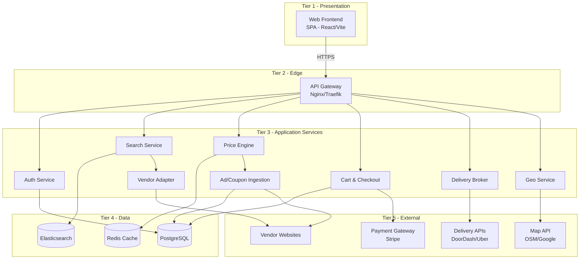
```mermaid
graph TB
    subgraph "Tier 1 - Presentation"
        UI[Web Frontend<br/>SPA - React/Vite]
    end

    subgraph "Tier 2 - Edge"
        GW[API Gateway<br/>Nginx/Traefik]
    end

    subgraph "Tier 3 - Application Services"
        AUTH[Auth Service]
        SEARCH[Search Service]
        PRICE[Price Engine]
        CART[Cart & Checkout]
        DELIVERY[Delivery Broker]
        ADS[Ad/Coupon Ingestion]
        VENDOR[Vendor Adapter]
        GEO[Geo Service]
    end

    subgraph "Tier 4 - Data"
        PG[(PostgreSQL)]
        REDIS[(Redis Cache)]
        ES[(Elasticsearch)]
    end

    subgraph "Tier 5 - External"
        VENDORS[Vendor Websites]
        MAPS[Map API<br/>OSM/Google]
        PAY[Payment Gateway<br/>Stripe]
        DELAPI[Delivery APIs<br/>DoorDash/Uber]
    end

    UI -->|HTTPS| GW
    GW --> AUTH
    GW --> SEARCH
    GW --> PRICE
    GW --> CART
    GW --> DELIVERY
    GW --> GEO

    SEARCH --> ES
    SEARCH --> VENDOR
    PRICE --> REDIS
    PRICE --> ADS
    AUTH --> PG
    CART --> PG
    CART --> PAY
    DELIVERY --> DELAPI
    VENDOR --> VENDORS
    GEO --> MAPS
    ADS --> PG
    ADS --> VENDORS
```

### 1.2 Domain Entities

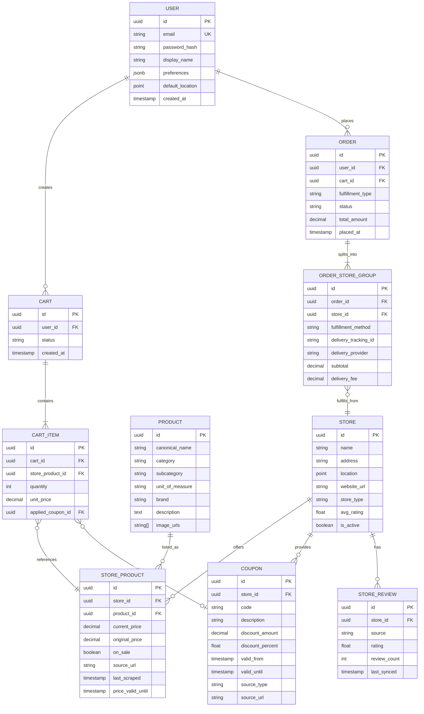
```mermaid
erDiagram
    USER {
        uuid id PK
        string email UK
        string password_hash
        string display_name
        jsonb preferences
        point default_location
        timestamp created_at
    }

    STORE {
        uuid id PK
        string name
        string address
        point location
        string website_url
        string store_type
        float avg_rating
        boolean is_active
    }

    PRODUCT {
        uuid id PK
        string canonical_name
        string category
        string subcategory
        string unit_of_measure
        string brand
        text description
        string[] image_urls
    }

    STORE_PRODUCT {
        uuid id PK
        uuid store_id FK
        uuid product_id FK
        decimal current_price
        decimal original_price
        boolean on_sale
        string source_url
        timestamp last_scraped
        timestamp price_valid_until
    }

    COUPON {
        uuid id PK
        uuid store_id FK
        string code
        string description
        decimal discount_amount
        float discount_percent
        timestamp valid_from
        timestamp valid_until
        string source_type
        string source_url
    }

    CART {
        uuid id PK
        uuid user_id FK
        string status
        timestamp created_at
    }

    CART_ITEM {
        uuid id PK
        uuid cart_id FK
        uuid store_product_id FK
        int quantity
        decimal unit_price
        uuid applied_coupon_id FK
    }

    ORDER {
        uuid id PK
        uuid user_id FK
        uuid cart_id FK
        string fulfillment_type
        string status
        decimal total_amount
        timestamp placed_at
    }

    ORDER_STORE_GROUP {
        uuid id PK
        uuid order_id FK
        uuid store_id FK
        string fulfillment_method
        string delivery_tracking_id
        string delivery_provider
        decimal subtotal
        decimal delivery_fee
    }

    STORE_REVIEW {
        uuid id PK
        uuid store_id FK
        string source
        float rating
        int review_count
        timestamp last_synced
    }

    USER ||--o{ CART : creates
    USER ||--o{ ORDER : places
    CART ||--|{ CART_ITEM : contains
    CART_ITEM }o--|| STORE_PRODUCT : references
    CART_ITEM }o--o| COUPON : applies
    ORDER ||--|{ ORDER_STORE_GROUP : splits_into
    ORDER_STORE_GROUP }o--|| STORE : fulfills_from
    STORE ||--o{ STORE_PRODUCT : offers
    PRODUCT ||--o{ STORE_PRODUCT : listed_as
    STORE ||--o{ COUPON : provides
    STORE ||--o{ STORE_REVIEW : has
```

### 1.3 Service Responsibility Matrix

| Service | Owns | Reads From | Writes To | External Deps |
|---------|------|-----------|-----------|---------------|
| Auth Service | USER | - | PostgreSQL | - |
| Search Service | - | Elasticsearch, PRODUCT, STORE_PRODUCT | Elasticsearch (index) | - |
| Vendor Adapter | STORE, STORE_PRODUCT | - | PostgreSQL, Elasticsearch | Vendor websites |
| Price Engine | - | STORE_PRODUCT, COUPON | Redis (cache) | - |
| Cart & Checkout | CART, CART_ITEM, ORDER, ORDER_STORE_GROUP | STORE_PRODUCT, COUPON | PostgreSQL | Stripe |
| Delivery Broker | - | ORDER_STORE_GROUP, STORE | - | DoorDash, Uber Direct |
| Ad/Coupon Ingestion | COUPON | STORE | PostgreSQL | Vendor ad pages |
| Geo Service | - | STORE | Redis (distance cache) | OSM/Google Maps |
| Store Review Aggregator | STORE_REVIEW | STORE | PostgreSQL | Yelp, Google, etc. |

### 1.4 Principles Mapping (Phase 1)

| Principle | Application |
|-----------|------------|
| `security.default_deny_and_explicit_allow` | All API endpoints deny by default; JWT required for authenticated routes |
| `security.least_privilege_everywhere` | Each service has its own DB user with scoped permissions |
| `security.threat_model_before_build` | Threat model produced in Phase 10 before implementation |
| `security.secrets_managed_not_stored` | All secrets injected via Docker secrets / env; never in source |
| `reliability.backward_compatible_change_policy` | API versioning from v1; schema migrations are additive |
| `scalability.performance_budgets_as_contracts` | Search < 500ms p95; checkout < 2s p95 |
| `governance.architecture_decisions_are_recorded` | ADRs maintained in `docs/adr/` |
| `security.release_runtime_non_root_identity` | All containers run as `trackuser` (UID 1000) |
| `operability.uniform_logging_with_syslog_severity_0_to_7` | All services use syslog severity 0-7 |
| `core_feature_review.multi_pass.dead_code_and_data_security` | Multi-pass review gates before merge |

### 1.5 Docker Compose Topology (Dev)

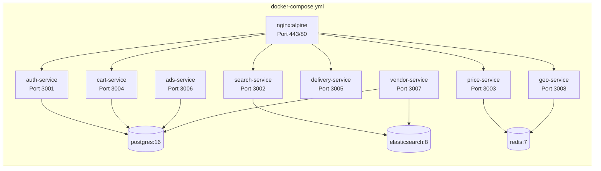
```mermaid
graph LR
    subgraph "docker-compose.yml"
        direction TB
        NGINX[nginx:alpine<br/>Port 443/80]
        AUTH_SVC[auth-service<br/>Port 3001]
        SEARCH_SVC[search-service<br/>Port 3002]
        PRICE_SVC[price-service<br/>Port 3003]
        CART_SVC[cart-service<br/>Port 3004]
        DELIVERY_SVC[delivery-service<br/>Port 3005]
        ADS_SVC[ads-service<br/>Port 3006]
        VENDOR_SVC[vendor-service<br/>Port 3007]
        GEO_SVC[geo-service<br/>Port 3008]
        PG_DB[(postgres:16)]
        REDIS_DB[(redis:7)]
        ES_DB[(elasticsearch:8)]
    end

    NGINX --> AUTH_SVC
    NGINX --> SEARCH_SVC
    NGINX --> PRICE_SVC
    NGINX --> CART_SVC
    NGINX --> DELIVERY_SVC
    NGINX --> GEO_SVC
    AUTH_SVC --> PG_DB
    CART_SVC --> PG_DB
    SEARCH_SVC --> ES_DB
    PRICE_SVC --> REDIS_DB
    ADS_SVC --> PG_DB
    VENDOR_SVC --> PG_DB
    VENDOR_SVC --> ES_DB
    GEO_SVC --> REDIS_DB
```

All application containers:
- Run as user `trackuser` (UID 1000, non-root)
- Have `read_only: true` root filesystem with explicit tmpfs mounts
- Use `no-new-privileges: true` security opt
- Health checks defined for orchestrator liveness probes

---

## Phase 2: Authentication & User Management

### 2.1 Overview

The Auth Service provides registration, login, session management, and profile management. It is the single source of truth for user identity and issues JWTs consumed by all other services.

### 2.2 Auth Flow

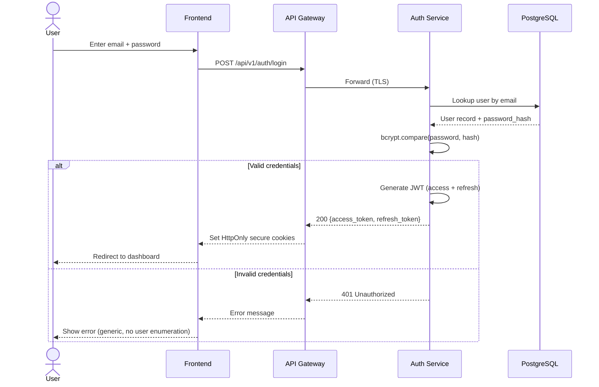
```mermaid
sequenceDiagram
    actor User
    participant UI as Frontend
    participant GW as API Gateway
    participant AUTH as Auth Service
    participant DB as PostgreSQL

    User->>UI: Enter email + password
    UI->>GW: POST /api/v1/auth/login
    GW->>AUTH: Forward (TLS)
    AUTH->>DB: Lookup user by email
    DB-->>AUTH: User record + password_hash
    AUTH->>AUTH: bcrypt.compare(password, hash)
    alt Valid credentials
        AUTH->>AUTH: Generate JWT (access + refresh)
        AUTH-->>GW: 200 {access_token, refresh_token}
        GW-->>UI: Set HttpOnly secure cookies
        UI-->>User: Redirect to dashboard
    else Invalid credentials
        AUTH-->>GW: 401 Unauthorized
        GW-->>UI: Error message
        UI-->>User: Show error (generic, no user enumeration)
    end
```

### 2.3 Token Architecture

| Token | Type | Lifetime | Storage | Purpose |
|-------|------|----------|---------|---------|
| Access Token | JWT (RS256) | 15 minutes | HttpOnly cookie | API authentication |
| Refresh Token | Opaque UUID | 7 days | HttpOnly cookie + DB | Token renewal |
| CSRF Token | Random string | Per-session | Response header + cookie | CSRF protection |

**Security controls:**
- Passwords hashed with bcrypt (cost factor 12)
- Rate limiting: 5 failed logins per 15-minute window per IP + email
- Account lockout after 10 consecutive failures (30-minute cooldown)
- JWT signed with RS256; public key distributed to services for verification
- Refresh tokens are single-use; rotation on each refresh
- All auth cookies: `Secure; HttpOnly; SameSite=Strict`

### 2.4 Registration Flow

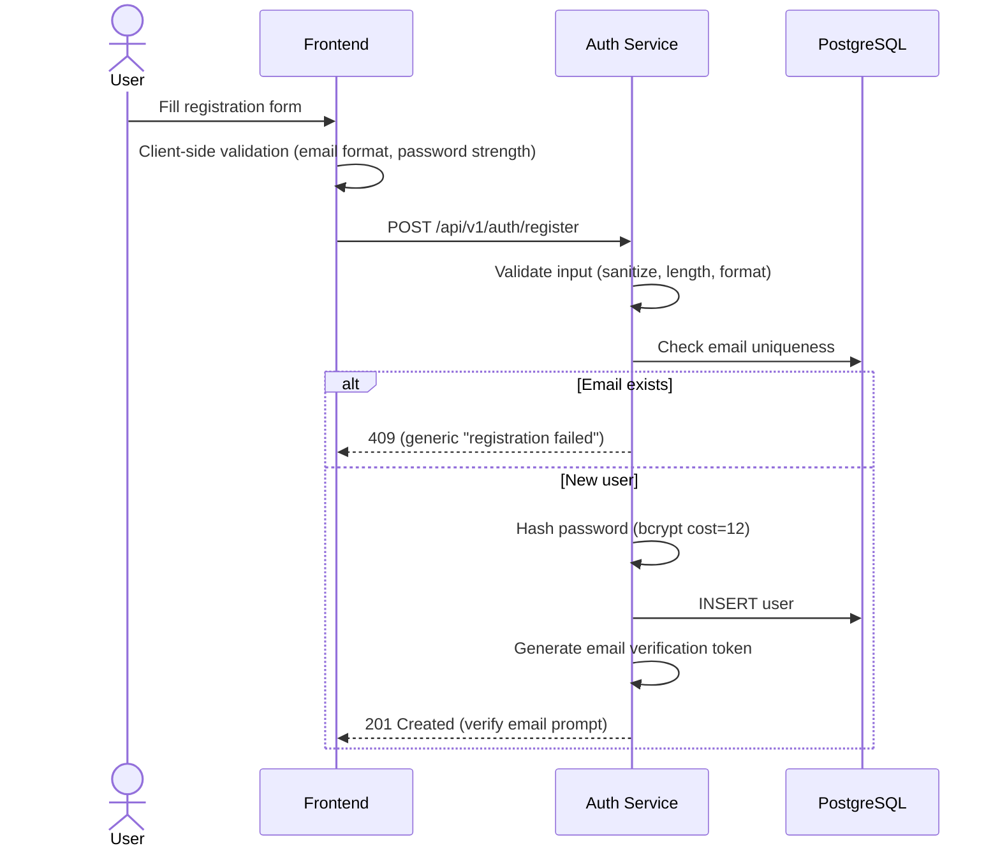
```mermaid
sequenceDiagram
    actor User
    participant UI as Frontend
    participant AUTH as Auth Service
    participant DB as PostgreSQL

    User->>UI: Fill registration form
    UI->>UI: Client-side validation (email format, password strength)
    UI->>AUTH: POST /api/v1/auth/register
    AUTH->>AUTH: Validate input (sanitize, length, format)
    AUTH->>DB: Check email uniqueness
    alt Email exists
        AUTH-->>UI: 409 (generic "registration failed")
    else New user
        AUTH->>AUTH: Hash password (bcrypt cost=12)
        AUTH->>DB: INSERT user
        AUTH->>AUTH: Generate email verification token
        AUTH-->>UI: 201 Created (verify email prompt)
    end
```

### 2.5 User Profile Data

```
User Profile {
  id: UUID
  email: string (verified)
  display_name: string
  default_location: { lat, lng } | null
  search_radius_miles: number (default: 25)
  preferred_categories: string[]
  notification_preferences: {
    price_drops: boolean
    deal_alerts: boolean
    order_updates: boolean
  }
  created_at: timestamp
  updated_at: timestamp
}
```

### 2.6 API Endpoints

| Method | Path | Auth | Description |
|--------|------|------|-------------|
| POST | `/api/v1/auth/register` | Public | Create account |
| POST | `/api/v1/auth/login` | Public | Authenticate |
| POST | `/api/v1/auth/logout` | Required | Invalidate session |
| POST | `/api/v1/auth/refresh` | Refresh token | Renew access token |
| GET | `/api/v1/users/me` | Required | Get profile |
| PATCH | `/api/v1/users/me` | Required | Update profile |
| POST | `/api/v1/auth/forgot-password` | Public | Request password reset |
| POST | `/api/v1/auth/reset-password` | Reset token | Set new password |

### 2.7 Principle Application

- `security.strong_authn_and_centralized_authz`: Single auth service issues all tokens; no ad-hoc auth in other services
- `security.validate_all_untrusted_input`: All registration/login inputs validated server-side
- `security.no_sensitive_data_in_logs`: Password fields and tokens never logged; log only user ID and action
- `security.output_encoding_and_injection_prevention`: Parameterized queries only; no string concatenation in SQL

---

## Phase 3: Product Search & Aggregation Engine

### 3.1 Overview

The Search Service provides full-text search across all products from all integrated stores. It normalizes user queries, handles misspellings, and returns results ranked by relevance with price/location data attached.

### 3.2 Search Pipeline

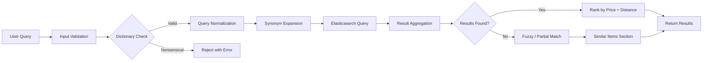
```mermaid
flowchart LR
    A[User Query] --> B[Input Validation]
    B --> C{Dictionary Check}
    C -->|Valid| D[Query Normalization]
    C -->|Nonsensical| E[Reject with Error]
    D --> F[Synonym Expansion]
    F --> G[Elasticsearch Query]
    G --> H[Result Aggregation]
    H --> I{Results Found?}
    I -->|Yes| J[Rank by Price + Distance]
    I -->|No| K[Fuzzy / Partial Match]
    K --> L[Similar Items Section]
    J --> M[Return Results]
    L --> M
```

### 3.3 Query Processing

**Input Validation Rules:**
- Minimum 2 characters, maximum 200 characters
- Must contain at least one dictionary word (English common-use dictionary)
- Strip HTML/script tags (XSS prevention)
- Allow minor misspellings (Levenshtein distance <= 2 triggers fuzzy search)
- Reject pure numeric, pure special-character, or known injection patterns

**Normalization Steps:**
1. Lowercase and trim whitespace
2. Remove special characters except hyphens and apostrophes
3. Expand common abbreviations (e.g., "oz" -> "ounce", "lb" -> "pound")
4. Apply stemming (Porter stemmer)
5. Synonym expansion from maintained dictionary (e.g., "soda" <-> "pop" <-> "soft drink")

### 3.4 Elasticsearch Index Design

```json
{
  "mappings": {
    "properties": {
      "product_id": { "type": "keyword" },
      "canonical_name": {
        "type": "text",
        "analyzer": "product_analyzer",
        "fields": {
          "keyword": { "type": "keyword" },
          "suggest": { "type": "completion" }
        }
      },
      "category": { "type": "keyword" },
      "subcategory": { "type": "keyword" },
      "brand": { "type": "text" },
      "description": { "type": "text" },
      "store_listings": {
        "type": "nested",
        "properties": {
          "store_id": { "type": "keyword" },
          "store_name": { "type": "text" },
          "current_price": { "type": "float" },
          "on_sale": { "type": "boolean" },
          "location": { "type": "geo_point" },
          "last_updated": { "type": "date" }
        }
      }
    }
  }
}
```

### 3.5 Search Results Response Shape

```
SearchResponse {
  query: string
  total_results: number
  results: [
    {
      product: { id, name, category, brand, image_url, description }
      best_price: { store_name, price, distance_miles, on_sale, coupon_available }
      listings: [
        { store_id, store_name, price, original_price, distance_miles, store_rating }
      ]
    }
  ]
  similar_items: [                    // Only populated on partial/fuzzy matches
    { product: {...}, best_price: {...} }
  ]
  search_metadata: {
    normalized_query: string
    fuzzy_applied: boolean
    response_time_ms: number
  }
}
```

### 3.6 Performance Budgets

| Metric | Budget | Measurement |
|--------|--------|-------------|
| Search latency (p50) | < 200ms | Gateway to response |
| Search latency (p95) | < 500ms | Gateway to response |
| Autocomplete latency | < 100ms | Keystroke to suggestion |
| Max results per page | 50 | Paginated |
| Index refresh interval | 30 seconds | Near-real-time |

### 3.7 API Endpoints

| Method | Path | Auth | Description |
|--------|------|------|-------------|
| GET | `/api/v1/search?q=&lat=&lng=&radius=&category=&page=` | Required | Full search |
| GET | `/api/v1/search/suggest?q=` | Required | Autocomplete |
| GET | `/api/v1/products/{id}` | Required | Product detail |
| GET | `/api/v1/categories` | Required | List categories |

---

## Phase 4: Vendor & Store Integration Layer

### 4.1 Overview

The Vendor Adapter is the data acquisition backbone. It integrates with local business websites, e-commerce platforms, and potentially third-party data aggregators to maintain an up-to-date inventory of products, prices, and store information.

### 4.2 Adapter Architecture

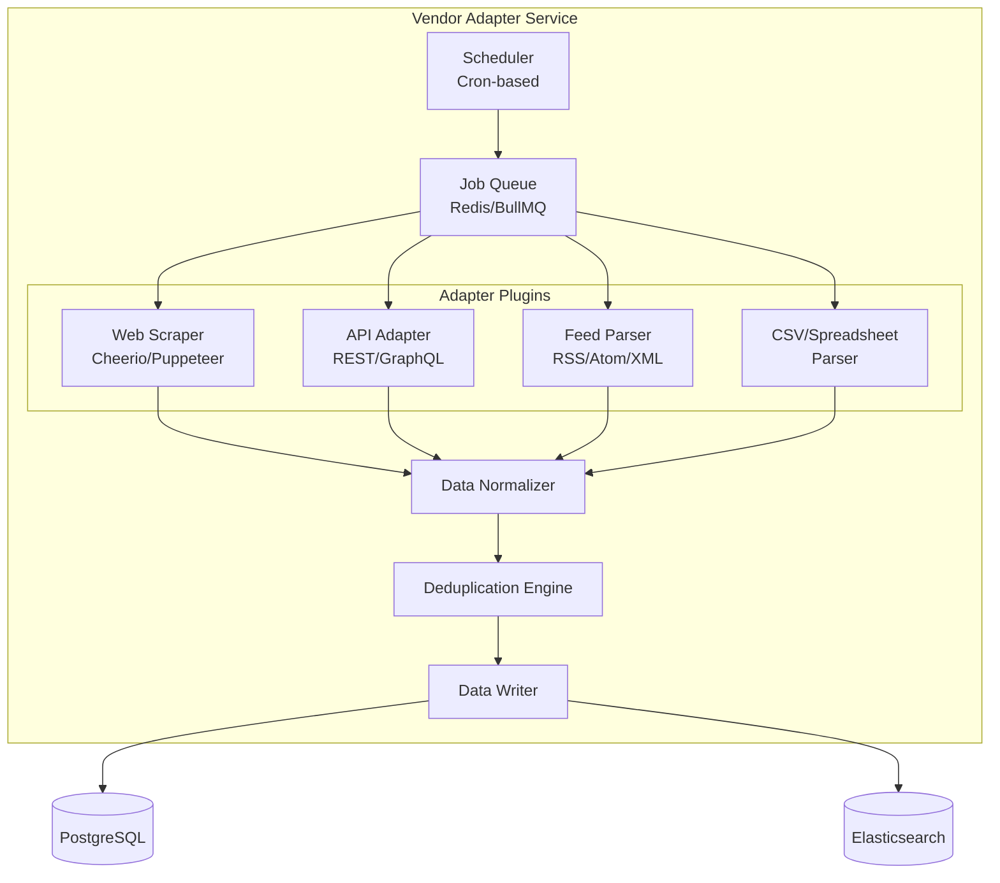
```mermaid
flowchart TB
    subgraph "Vendor Adapter Service"
        SCHED[Scheduler<br/>Cron-based]
        QUEUE[Job Queue<br/>Redis/BullMQ]

        subgraph "Adapter Plugins"
            WEB[Web Scraper<br/>Cheerio/Puppeteer]
            API_AD[API Adapter<br/>REST/GraphQL]
            FEED[Feed Parser<br/>RSS/Atom/XML]
            CSV_AD[CSV/Spreadsheet<br/>Parser]
        end

        NORM[Data Normalizer]
        DEDUP[Deduplication Engine]
        WRITER[Data Writer]
    end

    SCHED --> QUEUE
    QUEUE --> WEB
    QUEUE --> API_AD
    QUEUE --> FEED
    QUEUE --> CSV_AD

    WEB --> NORM
    API_AD --> NORM
    FEED --> NORM
    CSV_AD --> NORM

    NORM --> DEDUP
    DEDUP --> WRITER
    WRITER --> PG[(PostgreSQL)]
    WRITER --> ES[(Elasticsearch)]
```

### 4.3 Store Onboarding Process

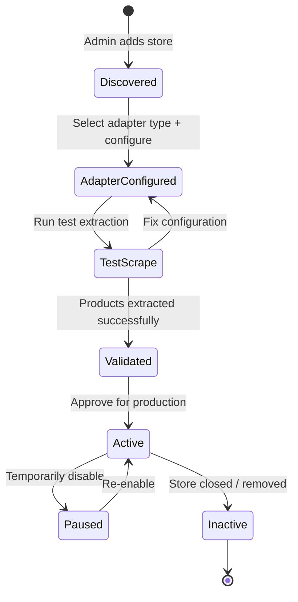
```mermaid
stateDiagram-v2
    [*] --> Discovered: Admin adds store
    Discovered --> AdapterConfigured: Select adapter type + configure
    AdapterConfigured --> TestScrape: Run test extraction
    TestScrape --> Validated: Products extracted successfully
    TestScrape --> AdapterConfigured: Fix configuration
    Validated --> Active: Approve for production
    Active --> Paused: Temporarily disable
    Paused --> Active: Re-enable
    Active --> Inactive: Store closed / removed
    Inactive --> [*]
```

### 4.4 Data Normalization Pipeline

**Product Name Normalization:**
1. Strip store-specific prefixes/suffixes ("Store Brand", "Private Selection", etc.)
2. Extract brand, product name, size/weight, variant
3. Map to canonical product using fuzzy matching against existing catalog
4. If no match > 85% confidence, create new canonical product entry
5. Human review queue for ambiguous matches (< 85%, > 60% confidence)

**Price Normalization:**
- Convert all prices to USD decimal (2 decimal places)
- Extract unit price where available (price per oz, per lb, per unit)
- Flag negative prices or prices > $10,000 for review
- Track price history for trend analysis

### 4.5 Scraping Ethics & Controls

| Control | Implementation |
|---------|---------------|
| robots.txt compliance | Check and respect before scraping |
| Rate limiting | Max 1 request/second per domain |
| User-Agent | Identify as `TrackThat-Bot/1.0 (+contact@trackhat.local)` |
| Cache | Cache page content for 1 hour to reduce requests |
| Opt-out | Stores can request exclusion via admin panel |
| Legal | Terms of service review per vendor before onboarding |

### 4.6 Store Data Model

```
Store {
  id: UUID
  name: string
  slug: string
  address: string
  city: string
  state: string
  zip: string
  location: { lat, lng }
  phone: string
  website_url: string
  store_type: enum [grocery, clothing, department, specialty, pharmacy, convenience]
  operating_hours: {
    [day]: { open: time, close: time }
  }
  adapter_type: enum [web_scraper, api, feed, csv, manual]
  adapter_config: jsonb (encrypted at rest)
  scrape_frequency_minutes: number
  is_active: boolean
  last_successful_scrape: timestamp
  product_count: number
  avg_rating: float
  created_at: timestamp
}
```

---

## Phase 5: Price Comparison & Deal Analysis

### 5.1 Overview

The Price Engine consumes product listings from all stores, applies active coupons/promotions, and computes a ranked "best deal" score per product per user location. This is the core value proposition of the platform.

### 5.2 Deal Scoring Algorithm

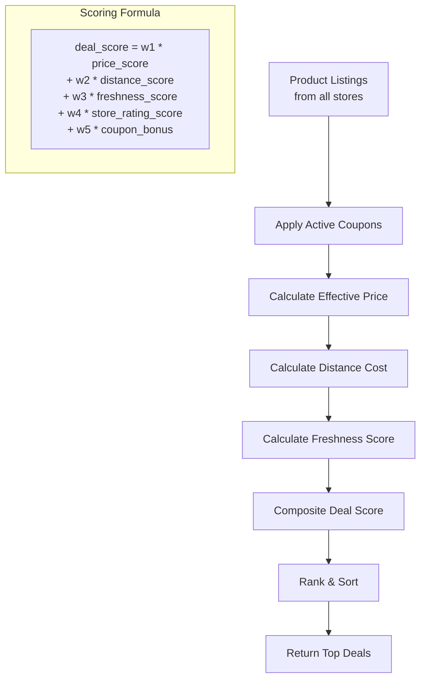
```mermaid
flowchart TB
    A[Product Listings<br/>from all stores] --> B[Apply Active Coupons]
    B --> C[Calculate Effective Price]
    C --> D[Calculate Distance Cost]
    D --> E[Calculate Freshness Score]
    E --> F[Composite Deal Score]
    F --> G[Rank & Sort]
    G --> H[Return Top Deals]

    subgraph "Scoring Formula"
        I["deal_score = w1 * price_score<br/>+ w2 * distance_score<br/>+ w3 * freshness_score<br/>+ w4 * store_rating_score<br/>+ w5 * coupon_bonus"]
    end
```

### 5.3 Scoring Components

| Component | Weight (default) | Calculation |
|-----------|-----------------|-------------|
| `price_score` | 0.45 | `1 - (effective_price / max_price_in_results)` |
| `distance_score` | 0.25 | `1 - (distance_miles / user_max_radius)` |
| `freshness_score` | 0.10 | `1 - (hours_since_last_scrape / 168)` (7-day window) |
| `store_rating_score` | 0.10 | `avg_rating / 5.0` |
| `coupon_bonus` | 0.10 | `1.0` if coupon applied, `0.0` otherwise |

**Effective Price Calculation:**
```
effective_price = base_price - max(
  coupon_absolute_discount,
  base_price * coupon_percent_discount / 100
)
```

### 5.4 Price Staleness Handling

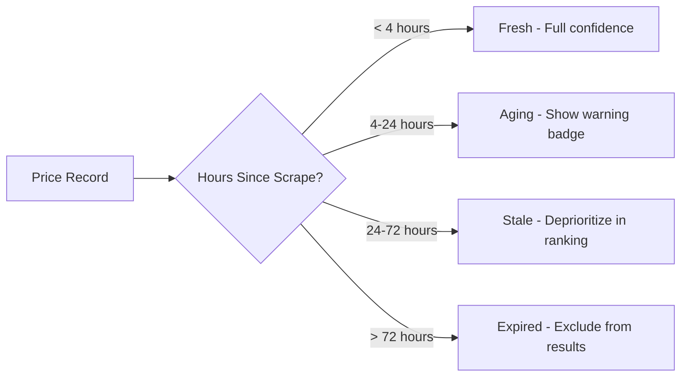
```mermaid
flowchart LR
    A[Price Record] --> B{Hours Since Scrape?}
    B -->|< 4 hours| C[Fresh - Full confidence]
    B -->|4-24 hours| D[Aging - Show warning badge]
    B -->|24-72 hours| E[Stale - Deprioritize in ranking]
    B -->|> 72 hours| F[Expired - Exclude from results]
```

### 5.5 Similar Items Fallback

When no exact match is found:

1. **Tokenize** the query into individual terms
2. **Partial match** against product names using Elasticsearch `match` with `minimum_should_match: 60%`
3. **Category match** using the most likely category from query terms
4. **Brand alternatives** if brand was detected, show other brands in same category
5. Label all fallback results as "Similar Items" at the bottom of results

### 5.6 API Endpoints

| Method | Path | Auth | Description |
|--------|------|------|-------------|
| GET | `/api/v1/prices/compare?product_id=&lat=&lng=&radius=` | Required | Compare prices for a product |
| GET | `/api/v1/prices/best-deals?category=&lat=&lng=&limit=` | Required | Top deals in area |
| GET | `/api/v1/prices/history/{store_product_id}` | Required | Price history for trending |

### 5.7 Caching Strategy

| Data | Cache Layer | TTL | Invalidation |
|------|------------|-----|-------------|
| Search results | Redis | 5 min | On new scrape for any listed store |
| Price comparisons | Redis | 10 min | On price change event |
| Store locations | Redis | 24 hours | On store update |
| Category list | Redis | 1 hour | On category change |

---

## Phase 6: Geolocation & Map Integration

### 6.1 Overview

The Geo Service resolves user locations, calculates distances to stores, and provides map data for the frontend. It uses OpenStreetMap (Nominatim for geocoding, Leaflet for rendering) as the primary open-source map provider, with Google Maps as an optional premium upgrade path.

### 6.2 Location Resolution Flow

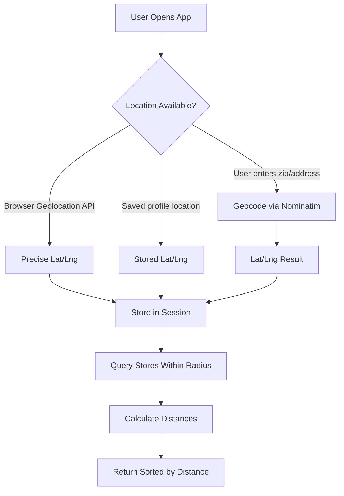
```mermaid
flowchart TB
    A[User Opens App] --> B{Location Available?}
    B -->|Browser Geolocation API| C[Precise Lat/Lng]
    B -->|User enters zip/address| D[Geocode via Nominatim]
    B -->|Saved profile location| E[Stored Lat/Lng]
    D --> F[Lat/Lng Result]
    C --> G[Store in Session]
    E --> G
    F --> G
    G --> H[Query Stores Within Radius]
    H --> I[Calculate Distances]
    I --> J[Return Sorted by Distance]
```

### 6.3 Distance Calculation

- **Method:** Haversine formula for straight-line distance (fast, sufficient for local search)
- **Enhancement path:** OSRM (Open Source Routing Machine) for actual driving/walking distance
- **Caching:** Store-to-store and user-to-store distances cached in Redis (keyed by geohash grid)
- **Geohash precision:** 5 characters (~4.9km x 4.9km grid) for cache bucketing

### 6.4 Store Proximity API

| Method | Path | Auth | Description |
|--------|------|------|-------------|
| GET | `/api/v1/geo/stores?lat=&lng=&radius=&type=` | Required | Stores within radius |
| GET | `/api/v1/geo/distance?from_lat=&from_lng=&store_id=` | Required | Distance to specific store |
| POST | `/api/v1/geo/geocode` | Required | Address to lat/lng |
| GET | `/api/v1/geo/reverse?lat=&lng=` | Required | Lat/lng to address |

### 6.5 Map Rendering (Frontend)

```
Map Component {
  Library: Leaflet.js + OpenStreetMap tiles
  Features:
    - User location marker (blue dot)
    - Store markers (color-coded by type: green=grocery, blue=clothing, etc.)
    - Radius circle overlay (configurable 1-50 miles)
    - Marker popups: store name, distance, best deal price
    - Cluster markers when zoomed out
    - Route preview (walking/driving) on store selection
  Controls:
    - Zoom in/out
    - Re-center on user
    - Filter by store type
    - Adjust radius slider
}
```

### 6.6 Privacy Controls

- Location is never stored server-side without explicit user consent
- Session-only location: used for current search, not persisted
- Saved location: user explicitly saves to profile; can delete anytime
- No background location tracking
- Location data never shared with vendors or third parties

---

## Phase 7: Multi-Store Cart & Checkout

### 7.1 Overview

The Cart & Checkout service handles the unique challenge of a **split-cart model** where a single user order may span multiple stores. Each store's items form a sub-order with independent fulfillment (pickup or delivery).

### 7.2 Cart Architecture

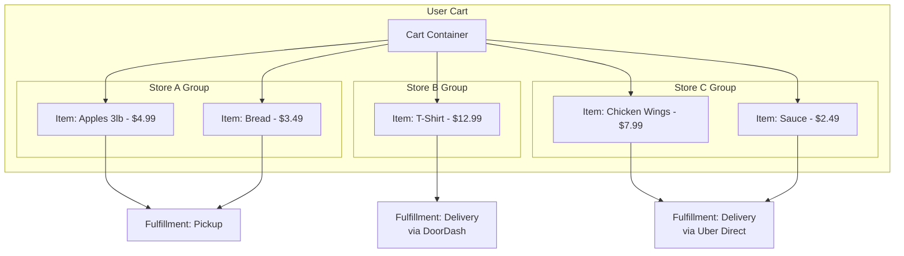
```mermaid
flowchart TB
    subgraph "User Cart"
        CART[Cart Container]
        subgraph "Store A Group"
            A1[Item: Apples 3lb - $4.99]
            A2[Item: Bread - $3.49]
        end
        subgraph "Store B Group"
            B1[Item: T-Shirt - $12.99]
        end
        subgraph "Store C Group"
            C1[Item: Chicken Wings - $7.99]
            C2[Item: Sauce - $2.49]
        end
    end

    CART --> A1
    CART --> A2
    CART --> B1
    CART --> C1
    CART --> C2

    A1 --> FA[Fulfillment: Pickup]
    A2 --> FA
    B1 --> FB[Fulfillment: Delivery<br/>via DoorDash]
    C1 --> FC[Fulfillment: Delivery<br/>via Uber Direct]
    C2 --> FC
```

### 7.3 Cart Lifecycle

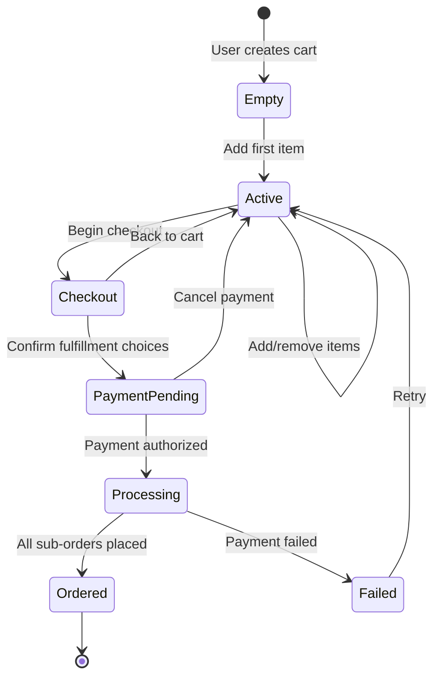
```mermaid
stateDiagram-v2
    [*] --> Empty: User creates cart
    Empty --> Active: Add first item
    Active --> Active: Add/remove items
    Active --> Checkout: Begin checkout
    Checkout --> PaymentPending: Confirm fulfillment choices
    PaymentPending --> Processing: Payment authorized
    Processing --> Ordered: All sub-orders placed
    Ordered --> [*]
    Checkout --> Active: Back to cart
    PaymentPending --> Active: Cancel payment
    Processing --> Failed: Payment failed
    Failed --> Active: Retry
```

### 7.4 Checkout Flow

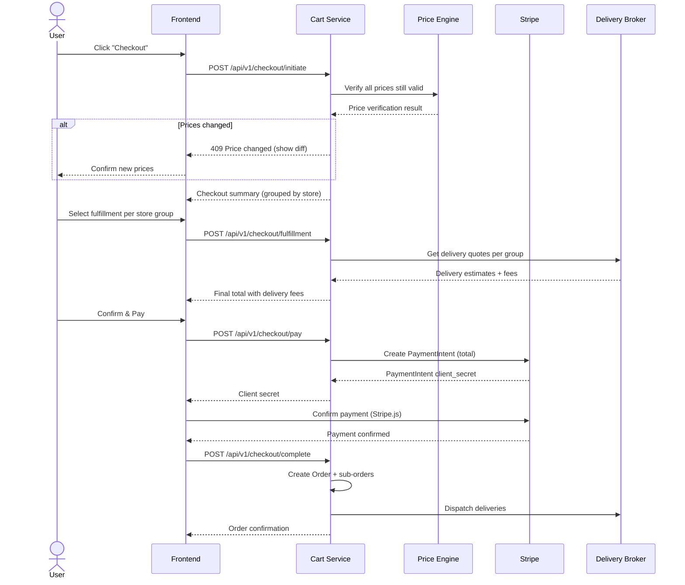
```mermaid
sequenceDiagram
    actor User
    participant UI as Frontend
    participant CART as Cart Service
    participant PRICE as Price Engine
    participant PAY as Stripe
    participant DEL as Delivery Broker

    User->>UI: Click "Checkout"
    UI->>CART: POST /api/v1/checkout/initiate
    CART->>PRICE: Verify all prices still valid
    PRICE-->>CART: Price verification result

    alt Prices changed
        CART-->>UI: 409 Price changed (show diff)
        UI-->>User: Confirm new prices
    end

    CART-->>UI: Checkout summary (grouped by store)
    User->>UI: Select fulfillment per store group
    UI->>CART: POST /api/v1/checkout/fulfillment
    CART->>DEL: Get delivery quotes per group
    DEL-->>CART: Delivery estimates + fees
    CART-->>UI: Final total with delivery fees

    User->>UI: Confirm & Pay
    UI->>CART: POST /api/v1/checkout/pay
    CART->>PAY: Create PaymentIntent (total)
    PAY-->>CART: PaymentIntent client_secret
    CART-->>UI: Client secret
    UI->>PAY: Confirm payment (Stripe.js)
    PAY-->>UI: Payment confirmed
    UI->>CART: POST /api/v1/checkout/complete
    CART->>CART: Create Order + sub-orders
    CART->>DEL: Dispatch deliveries
    CART-->>UI: Order confirmation
```

### 7.5 Price Lock Window

When a user enters checkout, prices are **locked for 15 minutes**. If the checkout is not completed within that window, prices are re-verified and the user is notified of any changes.

### 7.6 Payment Architecture

- **Provider:** Stripe (PCI-DSS Level 1 certified)
- **Integration:** Stripe.js + PaymentIntents API
- **Card storage:** Stripe's tokenized vault (SetupIntents for saved cards)
- **No card data touches our servers** -- compliant with SAQ-A
- **Refunds:** Automated via Stripe Refunds API for cancelled sub-orders
- **Split payments:** Single charge; platform manages sub-order accounting internally

### 7.7 API Endpoints

| Method | Path | Auth | Description |
|--------|------|------|-------------|
| GET | `/api/v1/cart` | Required | Get current cart |
| POST | `/api/v1/cart/items` | Required | Add item to cart |
| PATCH | `/api/v1/cart/items/{id}` | Required | Update quantity |
| DELETE | `/api/v1/cart/items/{id}` | Required | Remove item |
| POST | `/api/v1/checkout/initiate` | Required | Start checkout |
| POST | `/api/v1/checkout/fulfillment` | Required | Set fulfillment choices |
| POST | `/api/v1/checkout/pay` | Required | Process payment |
| POST | `/api/v1/checkout/complete` | Required | Finalize order |
| GET | `/api/v1/orders` | Required | Order history |
| GET | `/api/v1/orders/{id}` | Required | Order detail |

---

## Phase 8: Delivery Brokering & Fulfillment

### 8.1 Overview

The Delivery Broker selects the optimal delivery service for each store sub-order based on item type, weight, distance, and cost. It abstracts over multiple last-mile delivery APIs.

### 8.2 Fulfillment Decision Tree

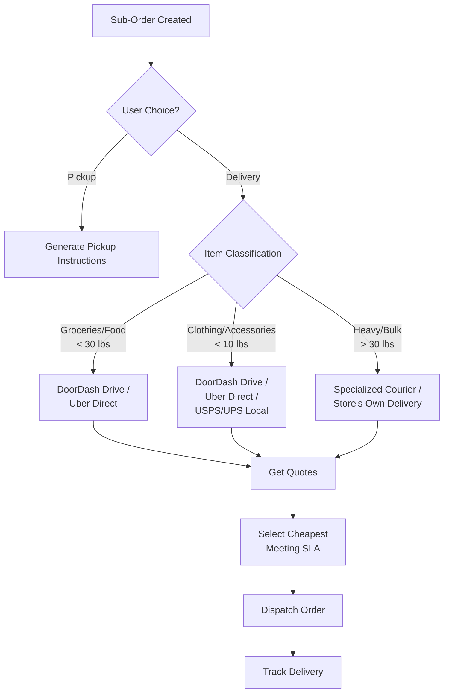
```mermaid
flowchart TB
    A[Sub-Order Created] --> B{User Choice?}
    B -->|Pickup| C[Generate Pickup Instructions]
    B -->|Delivery| D{Item Classification}

    D -->|Groceries/Food<br/>< 30 lbs| E[DoorDash Drive /<br/>Uber Direct]
    D -->|Clothing/Accessories<br/>< 10 lbs| F[DoorDash Drive /<br/>Uber Direct /<br/>USPS/UPS Local]
    D -->|Heavy/Bulk<br/>> 30 lbs| G[Specialized Courier /<br/>Store's Own Delivery]

    E --> H[Get Quotes]
    F --> H
    G --> H
    H --> I[Select Cheapest<br/>Meeting SLA]
    I --> J[Dispatch Order]
    J --> K[Track Delivery]
```

### 8.3 Delivery Provider Integration

| Provider | Use Case | API | Weight Limit | ETA |
|----------|----------|-----|-------------|-----|
| DoorDash Drive | Food, small goods | REST | 30 lbs | 30-60 min |
| Uber Direct | Food, small goods | REST | 25 lbs | 30-60 min |
| Store Pickup | All items | Internal | N/A | User-defined |
| USPS Local | Non-perishable goods | REST | 70 lbs | 1-3 days |
| Store Delivery | Heavy/bulk items | Webhook/manual | Varies | Store-defined |

### 8.4 Delivery Tracking

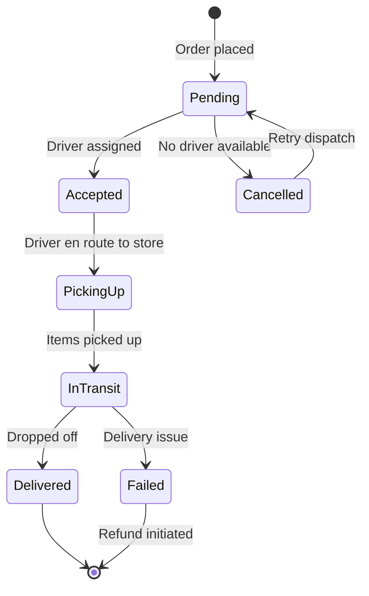
```mermaid
stateDiagram-v2
    [*] --> Pending: Order placed
    Pending --> Accepted: Driver assigned
    Accepted --> PickingUp: Driver en route to store
    PickingUp --> InTransit: Items picked up
    InTransit --> Delivered: Dropped off
    Delivered --> [*]
    Pending --> Cancelled: No driver available
    Cancelled --> Pending: Retry dispatch
    InTransit --> Failed: Delivery issue
    Failed --> [*]: Refund initiated
```

### 8.5 Webhook Events (Inbound from Providers)

| Event | Action |
|-------|--------|
| `driver_assigned` | Update status, store driver info |
| `pickup_complete` | Update status, notify user |
| `delivery_complete` | Update status, notify user, close sub-order |
| `delivery_failed` | Alert user, initiate retry or refund |
| `delivery_cancelled` | Re-dispatch or refund |

### 8.6 API Endpoints

| Method | Path | Auth | Description |
|--------|------|------|-------------|
| POST | `/api/v1/delivery/quote` | Required | Get delivery quotes for sub-order |
| POST | `/api/v1/delivery/dispatch` | Internal | Dispatch to provider |
| GET | `/api/v1/delivery/{id}/status` | Required | Track delivery |
| POST | `/api/v1/delivery/webhook/{provider}` | Provider HMAC | Inbound status updates |

### 8.7 Security for Delivery Webhooks

- Each provider webhook endpoint validates HMAC signature
- IP allowlisting for known provider IP ranges
- Webhook payloads logged (with PII redacted) for audit
- Replay protection via idempotency key / timestamp validation (5-minute window)

---

## Phase 9: Ad & Coupon Ingestion Pipeline

### 9.1 Overview

The Ad/Coupon Ingestion service systematically collects promotional data from store websites, weekly flyer pages, coupon aggregator sites, and RSS feeds to surface the best active deals to users.

### 9.2 Ingestion Pipeline

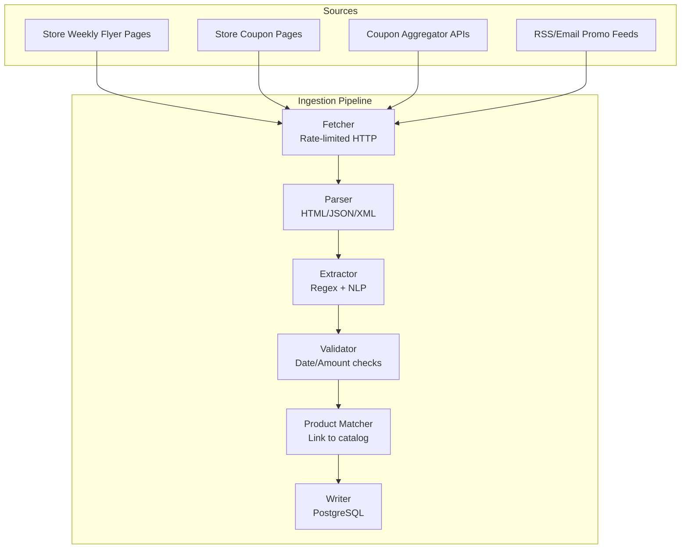
```mermaid
flowchart TB
    subgraph "Sources"
        S1[Store Weekly Flyer Pages]
        S2[Store Coupon Pages]
        S3[Coupon Aggregator APIs]
        S4[RSS/Email Promo Feeds]
    end

    subgraph "Ingestion Pipeline"
        FETCH[Fetcher<br/>Rate-limited HTTP]
        PARSE[Parser<br/>HTML/JSON/XML]
        EXTRACT[Extractor<br/>Regex + NLP]
        VALIDATE[Validator<br/>Date/Amount checks]
        MATCH[Product Matcher<br/>Link to catalog]
        STORE_W[Writer<br/>PostgreSQL]
    end

    S1 --> FETCH
    S2 --> FETCH
    S3 --> FETCH
    S4 --> FETCH

    FETCH --> PARSE
    PARSE --> EXTRACT
    EXTRACT --> VALIDATE
    VALIDATE --> MATCH
    MATCH --> STORE_W
```

### 9.3 Coupon Data Extraction

**Extracted Fields:**
```
CouponExtraction {
  store_id: UUID (matched from URL/domain)
  code: string | null (digital coupon may have no code)
  description: string
  discount_type: enum [percent, absolute, bogo, free_item]
  discount_value: decimal
  minimum_purchase: decimal | null
  applicable_products: string[] (matched to catalog)
  applicable_categories: string[]
  valid_from: date
  valid_until: date
  source_url: string
  source_type: enum [flyer, website, aggregator, email]
  confidence_score: float (0.0-1.0)
}
```

### 9.4 Ad Parsing Strategy

| Source Type | Parser | Extraction Method |
|------------|--------|-------------------|
| HTML flyer page | Cheerio | CSS selectors for price/product blocks |
| Image-based flyer (PDF/JPG) | OCR (Tesseract) | Text extraction + regex for prices |
| JSON API | Direct parse | Map fields to schema |
| RSS feed | xml2js | Extract from description/content fields |
| Email newsletter | IMAP + HTML parse | Similar to HTML flyer |

### 9.5 Coupon Validity Rules

- Reject coupons with `valid_until` in the past
- Auto-expire coupons at midnight on `valid_until` date
- Flag coupons with suspiciously high discounts (> 80%) for manual review
- Deduplicate by store_id + code + valid_period
- Confidence score < 0.6 goes to manual review queue

### 9.6 Scheduling

| Source Type | Frequency | Rationale |
|------------|-----------|-----------|
| Weekly flyers | Every Sunday + Wednesday | Most stores update weekly/mid-week |
| Coupon pages | Every 6 hours | Coupons can appear anytime |
| Aggregator APIs | Every 4 hours | Third-party data refresh |
| RSS feeds | Every 2 hours | Lightweight, low-cost |

### 9.7 API Endpoints

| Method | Path | Auth | Description |
|--------|------|------|-------------|
| GET | `/api/v1/coupons?store_id=&product_id=&active=true` | Required | Active coupons |
| GET | `/api/v1/deals/today?lat=&lng=&radius=` | Required | Today's best deals nearby |
| GET | `/api/v1/flyers/{store_id}` | Required | Current flyer for store |

---

## Phase 10: Observability, Security & Infrastructure

### 10.1 Threat Model

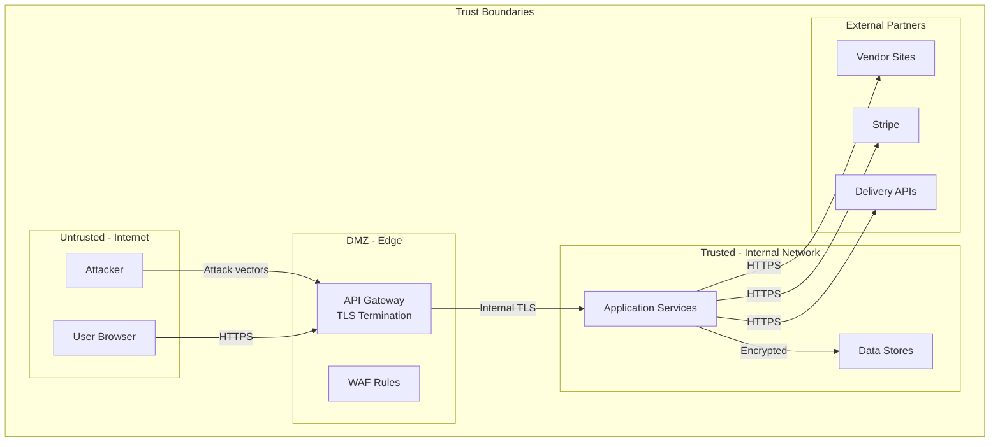
```mermaid
flowchart TB
    subgraph "Trust Boundaries"
        subgraph "Untrusted - Internet"
            ATTACKER[Attacker]
            USER_B[User Browser]
        end

        subgraph "DMZ - Edge"
            GW[API Gateway<br/>TLS Termination]
            WAF[WAF Rules]
        end

        subgraph "Trusted - Internal Network"
            SERVICES[Application Services]
            DATA[Data Stores]
        end

        subgraph "External Partners"
            VENDORS_E[Vendor Sites]
            PAY_E[Stripe]
            DEL_E[Delivery APIs]
        end
    end

    ATTACKER -->|Attack vectors| GW
    USER_B -->|HTTPS| GW
    GW -->|Internal TLS| SERVICES
    SERVICES -->|Encrypted| DATA
    SERVICES -->|HTTPS| VENDORS_E
    SERVICES -->|HTTPS| PAY_E
    SERVICES -->|HTTPS| DEL_E
```

### 10.2 Top Threats & Mitigations

| # | Threat | STRIDE | Severity | Mitigation |
|---|--------|--------|----------|-----------|
| T1 | SQL injection via search queries | Tampering | Critical | Parameterized queries only; input validation; WAF rules |
| T2 | XSS via product names/descriptions | Tampering | High | Output encoding (React auto-escapes); CSP headers; sanitize on ingest |
| T3 | CSRF on checkout/payment | Tampering | Critical | Double-submit CSRF tokens; SameSite=Strict cookies |
| T4 | Credential stuffing on login | Spoofing | High | Rate limiting; account lockout; bcrypt; optional MFA |
| T5 | Scraping abuse of our API | DoS | Medium | Rate limiting per user; API key for external access |
| T6 | Payment data exfiltration | Info Disclosure | Critical | No card data on our servers; Stripe.js handles all PCI data |
| T7 | Vendor adapter SSRF | Tampering | High | Allowlist domains for scraping; no user-supplied URLs in scraper |
| T8 | Delivery webhook spoofing | Spoofing | High | HMAC validation; IP allowlisting; replay protection |
| T9 | Privilege escalation via JWT | Elevation | Critical | RS256 signing; short-lived tokens; server-side validation |
| T10 | Sensitive data in logs | Info Disclosure | Medium | Log schema with redaction rules; no PII/tokens in logs |

### 10.3 Security Headers

```
Content-Security-Policy: default-src 'self'; script-src 'self'; style-src 'self' 'unsafe-inline'; img-src 'self' data: https://*.tile.openstreetmap.org; connect-src 'self' https://api.stripe.com; frame-ancestors 'none'
X-Content-Type-Options: nosniff
X-Frame-Options: DENY
X-XSS-Protection: 0 (CSP is the control)
Strict-Transport-Security: max-age=31536000; includeSubDomains
Referrer-Policy: strict-origin-when-cross-origin
Permissions-Policy: geolocation=(self), camera=(), microphone=()
```

### 10.4 Logging Architecture

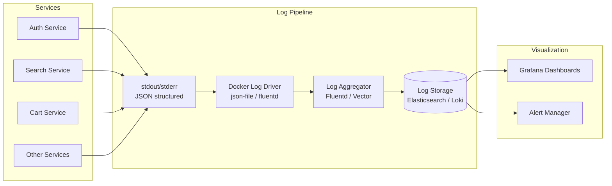
```mermaid
flowchart LR
    subgraph "Services"
        S1[Auth Service]
        S2[Search Service]
        S3[Cart Service]
        S4[Other Services]
    end

    subgraph "Log Pipeline"
        STDOUT[stdout/stderr<br/>JSON structured]
        DRIVER[Docker Log Driver<br/>json-file / fluentd]
        AGG[Log Aggregator<br/>Fluentd / Vector]
        STORE_L[(Log Storage<br/>Elasticsearch / Loki)]
    end

    subgraph "Visualization"
        DASH[Grafana Dashboards]
        ALERT[Alert Manager]
    end

    S1 --> STDOUT
    S2 --> STDOUT
    S3 --> STDOUT
    S4 --> STDOUT
    STDOUT --> DRIVER
    DRIVER --> AGG
    AGG --> STORE_L
    STORE_L --> DASH
    STORE_L --> ALERT
```

### 10.5 Syslog Severity Mapping (Mandatory)

| Severity | Level | Usage in Track-That |
|----------|-------|-------------------|
| 0 | Emergency | System-wide failure; all services down |
| 1 | Alert | Payment processing failure; data corruption detected |
| 2 | Critical | Auth service down; database unreachable |
| 3 | Error | Failed scrape; failed delivery dispatch; unhandled exception |
| 4 | Warning | Price staleness threshold exceeded; rate limit approaching |
| 5 | Notice | New store onboarded; coupon batch ingested; user registered |
| 6 | Informational | Search query processed; cart updated; order placed |
| 7 | Debug | Query timing; cache hit/miss; detailed flow trace |

### 10.6 Structured Log Format

```json
{
  "timestamp": "2026-03-22T14:30:00.123Z",
  "severity": 6,
  "service": "search-service",
  "request_id": "req-abc123",
  "user_id": "usr-def456",
  "action": "search.query",
  "message": "Search completed",
  "metadata": {
    "query": "organic apples",
    "results_count": 12,
    "response_time_ms": 187
  }
}
```

**Redaction rules:** `password`, `token`, `card_*`, `ssn`, `email` fields are NEVER logged. Email is replaced with hash for correlation.

### 10.7 Metrics & Dashboards

| Dashboard | Key Metrics |
|-----------|------------|
| Search Performance | p50/p95/p99 latency, queries/sec, zero-result rate |
| Scrape Health | Success rate by store, items updated/hour, staleness % |
| Cart & Checkout | Conversion rate, abandonment rate, payment success rate |
| Delivery | Dispatch success, avg delivery time, failure rate by provider |
| Auth | Login success/failure rate, registration rate, active sessions |
| Infrastructure | CPU/memory per container, error rate, request volume |

### 10.8 Input Sanitization Controls

| Attack Vector | Control | Implementation |
|---------------|---------|---------------|
| SQL Injection | Parameterized queries | All DB access via ORM (Prisma/Drizzle) with prepared statements |
| XSS | Output encoding | React auto-escapes; DOMPurify for any raw HTML rendering |
| CSRF | Token validation | Double-submit cookie pattern; SameSite=Strict |
| Command Injection | No shell execution | No child_process.exec with user input |
| Path Traversal | Input validation | Reject `../` sequences; allowlist file paths |
| SSRF | Domain allowlist | Scraper only accesses pre-configured store URLs |

---

## Phase 11: Data Layer & Storage Architecture

### 11.1 Database Selection Rationale

| Store | Technology | Purpose | Justification |
|-------|-----------|---------|--------------|
| Primary | PostgreSQL 16 | Users, stores, products, orders, coupons | ACID transactions for financial data; PostGIS for geospatial |
| Search | Elasticsearch 8 | Full-text product search, autocomplete | Purpose-built for text search; geo-queries |
| Cache | Redis 7 | Session, price cache, rate limiting, job queue | Sub-ms latency; pub/sub for invalidation |

### 11.2 PostgreSQL Schema Organization

```
Schemas:
  auth.*         -- users, sessions, refresh_tokens
  catalog.*      -- products, stores, store_products, categories
  commerce.*     -- carts, cart_items, orders, order_store_groups
  promotions.*   -- coupons, flyer_sources, ad_campaigns
  reviews.*      -- store_reviews, review_sources
```

**Access control:** Each service has a dedicated PostgreSQL role:
- `auth_svc` → read/write on `auth.*`
- `search_svc` → read on `catalog.*`
- `cart_svc` → read/write on `commerce.*`, read on `catalog.*`, `promotions.*`
- `vendor_svc` → read/write on `catalog.*`
- `ads_svc` → read/write on `promotions.*`, read on `catalog.*`

### 11.3 Data Lifecycle

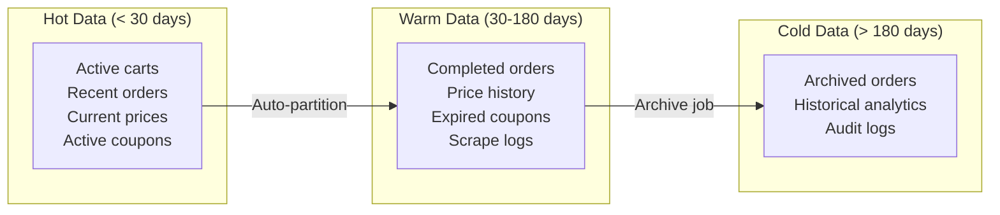
```mermaid
flowchart LR
    subgraph "Hot Data (< 30 days)"
        HD[Active carts<br/>Recent orders<br/>Current prices<br/>Active coupons]
    end

    subgraph "Warm Data (30-180 days)"
        WD[Completed orders<br/>Price history<br/>Expired coupons<br/>Scrape logs]
    end

    subgraph "Cold Data (> 180 days)"
        CD[Archived orders<br/>Historical analytics<br/>Audit logs]
    end

    HD -->|Auto-partition| WD
    WD -->|Archive job| CD
```

### 11.4 Backup & Recovery

| Component | Strategy | RPO | RTO |
|-----------|----------|-----|-----|
| PostgreSQL | Continuous WAL archiving + daily base backup | 5 min | 30 min |
| Elasticsearch | Daily snapshot to object storage | 24 hours | 2 hours |
| Redis | RDB snapshots every 15 min + AOF | 15 min | 5 min |

### 11.5 Encryption at Rest

- PostgreSQL: Transparent Data Encryption via filesystem encryption (LUKS/dm-crypt on Docker volumes)
- Elasticsearch: Encrypted snapshots; node-level encryption
- Redis: No PII stored; cache-only data; AOF encrypted at volume level
- Sensitive fields (adapter_config for stores): Application-level AES-256-GCM encryption before storage

### 11.6 Migration Strategy

- Tool: Prisma Migrate (or raw SQL migrations tracked in `migrations/`)
- All migrations are **additive** (no destructive column drops without deprecation period)
- Migration files version-controlled in Git
- Rollback scripts required for every migration
- CI runs migrations against test database before merge

---

## Phase 12: API Gateway & Service Mesh

### 12.1 Gateway Architecture

```mermaid
flowchart TB
    CLIENT[Client Browser] -->|HTTPS :443| LB[Load Balancer<br/>Traefik]

    LB --> RATE[Rate Limiter<br/>Middleware]
    RATE --> CORS[CORS Handler]
    CORS --> AUTH_MW[Auth Middleware<br/>JWT Validation]
    AUTH_MW --> ROUTE[Router<br/>Path-based]

    ROUTE --> |/api/v1/auth/*| AUTH_SVC[Auth Service :3001]
    ROUTE --> |/api/v1/search/*| SEARCH_SVC[Search Service :3002]
    ROUTE --> |/api/v1/prices/*| PRICE_SVC[Price Service :3003]
    ROUTE --> |/api/v1/cart/*<br/>/api/v1/checkout/*<br/>/api/v1/orders/*| CART_SVC[Cart Service :3004]
    ROUTE --> |/api/v1/delivery/*| DEL_SVC[Delivery Service :3005]
    ROUTE --> |/api/v1/coupons/*<br/>/api/v1/deals/*| ADS_SVC[Ads Service :3006]
    ROUTE --> |/api/v1/geo/*| GEO_SVC[Geo Service :3008]
    ROUTE --> |/*| STATIC[Static Frontend<br/>Nginx :80]
```

### 12.2 Rate Limiting Tiers

| Tier | Limit | Scope | Applies To |
|------|-------|-------|-----------|
| Anonymous | 30 req/min | Per IP | Public endpoints (login, register) |
| Authenticated | 120 req/min | Per user | Standard API access |
| Search | 60 req/min | Per user | Search endpoints (prevent scraping) |
| Checkout | 10 req/min | Per user | Payment endpoints |
| Webhook | 300 req/min | Per provider IP | Delivery webhooks |

### 12.3 CORS Configuration

```
Access-Control-Allow-Origin: https://trackhat.local (production domain)
Access-Control-Allow-Methods: GET, POST, PATCH, DELETE, OPTIONS
Access-Control-Allow-Headers: Content-Type, Authorization, X-CSRF-Token, X-Request-ID
Access-Control-Allow-Credentials: true
Access-Control-Max-Age: 7200
```

### 12.4 Request ID Propagation

Every request receives a unique `X-Request-ID` at the gateway (UUID v4). This ID is:
- Passed to all downstream services via header
- Included in every log entry (`request_id` field)
- Returned to the client in response headers
- Used for distributed tracing correlation

### 12.5 Health Check Endpoints

Each service exposes:
- `GET /healthz` — Liveness (returns 200 if process is running)
- `GET /readyz` — Readiness (returns 200 if dependencies are reachable)

Gateway aggregates health at `GET /api/v1/health` for monitoring.

### 12.6 Service Discovery

- **Dev:** Docker Compose DNS (service names resolve to container IPs)
- **Production:** Docker Swarm / Kubernetes DNS-based service discovery
- No hardcoded IPs; all service-to-service communication uses service names
- DNS over UDP/53 as specified in requirements

---

## Phase 13: Frontend Web Application

### 13.1 Technology Stack

| Layer | Choice | Rationale |
|-------|--------|-----------|
| Framework | React 18 + Vite | Fast, lightweight, large ecosystem |
| Language | TypeScript | Type safety across frontend |
| Styling | Tailwind CSS | Utility-first, small bundle, fast iteration |
| State | Zustand | Minimal boilerplate, lightweight |
| HTTP | Axios + React Query | Caching, retry, optimistic updates |
| Maps | Leaflet + react-leaflet | Open source, no API key required for OSM tiles |
| Forms | React Hook Form + Zod | Validation with type inference |
| Payments | Stripe.js + @stripe/react-stripe-js | PCI-compliant card input |
| Router | React Router v6 | Standard routing |
| Build | Vite (production build) | Tree-shaking, code splitting, fast HMR |

### 13.2 Page Architecture

```mermaid
flowchart TB
    subgraph "Public Pages"
        LOGIN[/login]
        REGISTER[/register]
        FORGOT[/forgot-password]
        RESET[/reset-password]
    end

    subgraph "Authenticated Pages"
        HOME[/ - Home/Dashboard]
        SEARCH[/search?q=]
        PRODUCT[/product/:id]
        MAP[/map]
        CART[/cart]
        CHECKOUT[/checkout]
        CONFIRM[/order-confirmation/:id]
        ORDERS[/orders]
        ORDER_DET[/orders/:id]
        PROFILE[/profile]
        SETTINGS[/settings]
    end

    LOGIN --> HOME
    REGISTER --> HOME
    HOME --> SEARCH
    SEARCH --> PRODUCT
    SEARCH --> MAP
    PRODUCT --> CART
    MAP --> PRODUCT
    CART --> CHECKOUT
    CHECKOUT --> CONFIRM
    HOME --> ORDERS
    ORDERS --> ORDER_DET
```

### 13.3 Component Hierarchy

```
App
├── AuthLayout
│   ├── LoginPage
│   ├── RegisterPage
│   └── ForgotPasswordPage
├── MainLayout
│   ├── TopNav { SearchBar, CartIcon, UserMenu }
│   ├── HomePage
│   │   ├── HeroSearch
│   │   ├── DealCarousel
│   │   ├── CategoryGrid
│   │   └── NearbyStoresPreview
│   ├── SearchResultsPage
│   │   ├── FilterSidebar { Category, PriceRange, Distance, StoreType }
│   │   ├── ResultsList
│   │   │   └── ProductCard { Image, Name, BestPrice, StoreBadge, DistanceBadge }
│   │   ├── SimilarItemsSection
│   │   └── MapToggle → MapView
│   ├── ProductDetailPage
│   │   ├── ProductHeader { Image, Name, Category }
│   │   ├── PriceComparisonTable { Store, Price, Distance, Rating, CouponBadge }
│   │   ├── StoreLocationMap
│   │   └── AddToCartForm { StoreSelector, QuantityInput, AddButton }
│   ├── MapPage
│   │   ├── FullScreenMap { StoreMarkers, RadiusCircle, UserPin }
│   │   ├── StoreListSidebar
│   │   └── StoreDetailPopup
│   ├── CartPage
│   │   ├── StoreGroupCard (per store)
│   │   │   ├── CartItemRow { Product, Qty, Price, Remove }
│   │   │   ├── FulfillmentSelector { Pickup, Delivery }
│   │   │   └── StoreSubtotal
│   │   └── CartSummary { Total, CheckoutButton }
│   ├── CheckoutPage
│   │   ├── FulfillmentSummary
│   │   ├── DeliveryAddressForm
│   │   ├── PaymentForm (Stripe Elements)
│   │   ├── OrderReview
│   │   └── PlaceOrderButton
│   ├── OrderConfirmationPage
│   │   ├── OrderSummary
│   │   └── DeliveryTracking (per store group)
│   ├── OrdersPage
│   │   └── OrderHistoryList
│   ├── ProfilePage
│   │   ├── PersonalInfo
│   │   ├── SavedLocations
│   │   ├── NotificationPrefs
│   │   └── SavedPaymentMethods (Stripe portal link)
│   └── SettingsPage
│       ├── SearchRadius
│       ├── DefaultLocation
│       └── CategoryPreferences
└── SharedComponents
    ├── LoadingSpinner
    ├── ErrorBoundary
    ├── EmptyState
    ├── Pagination
    ├── Toast / Notification
    ├── Modal
    └── Badge { Sale, Coupon, BestDeal }
```

### 13.4 Responsive Breakpoints

| Breakpoint | Width | Layout |
|-----------|-------|--------|
| Mobile | < 640px | Single column, bottom nav, stacked cards |
| Tablet | 640-1024px | Two columns, side nav, card grid |
| Desktop | > 1024px | Three columns, top nav, full map + list |

### 13.5 Performance Budgets (Frontend)

| Metric | Budget |
|--------|--------|
| First Contentful Paint | < 1.5s |
| Largest Contentful Paint | < 2.5s |
| Time to Interactive | < 3.5s |
| Total bundle size (gzipped) | < 200KB |
| Per-route chunk | < 50KB |
| Image loading | Lazy, WebP format, responsive srcset |

### 13.6 Accessibility

- WCAG 2.1 AA compliance target
- Semantic HTML throughout
- Keyboard navigation for all interactive elements
- ARIA labels for icons and non-text elements
- Color contrast ratio >= 4.5:1
- Screen reader testing with VoiceOver / NVDA

### 13.7 Immutable Output Display (Security)

Per the requirement that displayed items are immutable and view-only to protect users:
- All product data rendered as read-only text/images
- No `contenteditable` attributes on product data
- No `dangerouslySetInnerHTML` for product content; use DOMPurify if absolutely necessary
- CSP prevents inline script execution
- Product images served from our CDN (re-hosted), not direct vendor URLs

---

## Phase 14: Testing Strategy & CI/CD Pipeline

### 14.1 Test Pyramid

```mermaid
graph TB
    subgraph "Test Pyramid"
        E2E[E2E Tests<br/>Playwright<br/>~20 critical paths]
        INT[Integration Tests<br/>Supertest + TestContainers<br/>~100 tests per service]
        UNIT[Unit Tests<br/>Vitest/Jest<br/>~500+ tests per service]
    end

    E2E -.-> INT
    INT -.-> UNIT

    style E2E fill:#ff6b6b,color:#fff
    style INT fill:#ffd93d,color:#000
    style UNIT fill:#6bcb77,color:#fff
```

### 14.2 Test Coverage Requirements

| Layer | Target | Gate |
|-------|--------|------|
| Unit tests | >= 80% line coverage | Merge blocker |
| Integration tests | All API endpoints | Merge blocker |
| E2E tests | Critical user flows (search, cart, checkout) | Release blocker |
| Security tests | OWASP Top 10 checks per endpoint | Release blocker |
| Performance tests | Budget validation (p95 latencies) | Release blocker |

### 14.3 Testing Patterns by Service

| Service | Unit Tests | Integration Tests |
|---------|-----------|-------------------|
| Auth | Password hashing, JWT generation, input validation | Login/register flows against real PostgreSQL |
| Search | Query normalization, synonym expansion, scoring | Elasticsearch queries against test index |
| Vendor Adapter | HTML parsing, data normalization, deduplication | Scraper against mock HTTP server |
| Price Engine | Score calculation, coupon application, staleness | Price comparison with seeded data |
| Cart & Checkout | Cart manipulation, price lock, order creation | Full checkout flow with Stripe test mode |
| Delivery Broker | Provider selection logic, weight routing | Webhook handling with mock payloads |
| Ad Ingestion | Coupon extraction, date validation, confidence scoring | Full pipeline against mock ad pages |

### 14.4 CI/CD Pipeline

```mermaid
flowchart LR
    A[Git Push] --> B[Lint + Format<br/>ESLint, Prettier]
    B --> C[Unit Tests<br/>Vitest/Jest]
    C --> D[Build Docker<br/>Images]
    D --> E[Integration Tests<br/>docker-compose.test.yml]
    E --> F[Security Scan<br/>Trivy + npm audit]
    F --> G[E2E Tests<br/>Playwright]
    G --> H{All Pass?}
    H -->|Yes| I[Push Images to<br/>Registry]
    H -->|No| J[Block Merge]
    I --> K[Deploy to Staging<br/>Canary]
    K --> L[Smoke Tests]
    L --> M{Pass?}
    M -->|Yes| N[Promote to<br/>Production]
    M -->|No| O[Rollback]
```

### 14.5 CI Checks Manifest

| Check | Tool | Blocks |
|-------|------|--------|
| Linting | ESLint (strict config) | Merge |
| Formatting | Prettier | Merge |
| Type checking | TypeScript `tsc --noEmit` | Merge |
| Unit tests | Vitest | Merge |
| Integration tests | Vitest + TestContainers | Merge |
| Dependency audit | `npm audit --audit-level=high` | Merge |
| Container scan | Trivy (HIGH/CRITICAL) | Merge |
| Secret scan | TruffleHog / GitLeaks | Merge |
| License check | license-checker (reject copyleft for prod deps) | Merge |
| Migration check | Prisma migrate diff (no destructive changes) | Merge |
| E2E tests | Playwright | Release |
| Performance tests | k6 / Artillery | Release |
| Commit message | commitlint (conventional commits) | Merge |

### 14.6 Non-Root Validation in CI

```yaml
# CI step: Verify no container runs as root
- name: Verify non-root runtime
  run: |
    for img in $(docker-compose config --images); do
      USER=$(docker inspect --format='{{.Config.User}}' "$img")
      if [ "$USER" = "" ] || [ "$USER" = "root" ] || [ "$USER" = "0" ]; then
        echo "FAIL: $img runs as root"
        exit 1
      fi
    done
```

---

## Phase 15: Release, Rollout & Operations

### 15.1 Canary Deployment Strategy

```mermaid
flowchart LR
    A[Build Passes CI] --> B[Deploy to<br/>Canary 5%]
    B --> C{Health Metrics<br/>OK for 15 min?}
    C -->|Yes| D[Expand to 25%]
    D --> E{Health Metrics<br/>OK for 30 min?}
    E -->|Yes| F[Expand to 100%]
    E -->|No| G[Rollback to<br/>Previous Version]
    C -->|No| G
```

### 15.2 Rollback Criteria

Auto-rollback triggers:
- Error rate > 5% (measured at gateway)
- p95 latency > 2x baseline
- Payment failure rate > 2%
- Container crash loop (> 3 restarts in 5 minutes)
- Health check failures on > 1 instance

### 15.3 Feature Flags

| Flag | Type | Purpose |
|------|------|---------|
| `enable_delivery_uber` | Boolean | Enable/disable Uber Direct integration |
| `enable_delivery_doordash` | Boolean | Enable/disable DoorDash Drive integration |
| `search_fuzzy_threshold` | Number | Adjust fuzzy match sensitivity |
| `coupon_confidence_threshold` | Number | Minimum confidence for auto-publish |
| `max_search_radius_miles` | Number | Cap on user search radius |
| `enable_payment` | Boolean | Master switch for checkout flow |

Feature flags stored in PostgreSQL, cached in Redis (5-min TTL), with admin UI for toggling.

### 15.4 Operational Runbooks

| Runbook | Trigger | Steps |
|---------|---------|-------|
| Service Recovery | Container crash loop | Check logs → verify dependencies → restart → escalate if persists |
| Scrape Failure | > 50% scrape failures for a store | Check target site → update adapter → disable store if broken |
| Payment Outage | Stripe webhook failures | Check Stripe status page → retry failed webhooks → manual reconciliation |
| Delivery Dispatch Failure | No driver assigned in 30 min | Retry with alternate provider → notify user → offer pickup fallback |
| Database Recovery | PostgreSQL unreachable | Failover to replica → investigate primary → restore from WAL |
| Cache Failure | Redis down | Services degrade to DB-direct queries → restart Redis → warm cache |

### 15.5 Incident Severity Classification

| Severity | Description | Response Time | Example |
|----------|-------------|---------------|---------|
| Sev 0 (Emergency) | Full outage, data loss risk | Immediate | Database corruption, all services down |
| Sev 1 (Alert) | Major feature broken for all users | 15 min | Payment processing down, auth broken |
| Sev 2 (Critical) | Feature degraded for subset of users | 1 hour | One delivery provider failing, search slow |
| Sev 3 (Error) | Minor feature broken, workaround exists | 4 hours | One store's scraper failing, coupon display bug |
| Sev 4 (Warning) | Monitoring anomaly, no user impact yet | Next business day | Unusual traffic pattern, disk usage trending up |

### 15.6 Environment Strategy

| Environment | Purpose | Data | Access |
|-------------|---------|------|--------|
| Local (Docker Compose) | Developer workstation | Seed data | Developer |
| CI | Automated tests | Generated test data | CI system |
| Staging | Pre-production validation | Anonymized prod snapshot | Team |
| Production | Live system | Real data | Operations (non-root) |

### 15.7 Container Runtime Security Summary

```
All production containers:
  ✓ Run as user: trackuser (UID 1000)
  ✓ read_only: true (root filesystem)
  ✓ no-new-privileges: true
  ✓ cap_drop: ALL
  ✓ cap_add: [] (none)
  ✓ tmpfs: /tmp (for transient data only)
  ✓ Health checks defined
  ✓ Resource limits (CPU + memory) set
  ✓ No privileged mode
  ✓ No host network mode
```

---

## End-to-End User Journey (Happy Path)

```mermaid
sequenceDiagram
    actor User
    participant UI as Frontend
    participant AUTH as Auth
    participant SEARCH as Search
    participant PRICE as Price Engine
    participant GEO as Geo
    participant CART as Cart
    participant PAY as Stripe
    participant DEL as Delivery

    User->>UI: Open app
    UI->>AUTH: Login
    AUTH-->>UI: JWT issued

    User->>UI: Search "organic chicken breast"
    UI->>SEARCH: GET /search?q=organic+chicken+breast&lat=&lng=
    SEARCH->>SEARCH: Validate, normalize, query ES
    SEARCH-->>UI: Results (5 stores, prices $4.99-$8.99)

    User->>UI: View price comparison
    UI->>PRICE: GET /prices/compare?product_id=X
    PRICE->>PRICE: Apply coupons, score deals
    PRICE-->>UI: Ranked results (Store A: $4.99 best deal)

    User->>UI: View on map
    UI->>GEO: GET /geo/stores?lat=&lng=&radius=10
    GEO-->>UI: Store locations + distances

    User->>UI: Add to cart (Store A + Store C items)
    UI->>CART: POST /cart/items (x2)
    CART-->>UI: Cart updated (2 store groups)

    User->>UI: Checkout
    UI->>CART: POST /checkout/initiate
    CART->>PRICE: Verify prices
    CART->>DEL: Get delivery quotes
    CART-->>UI: Summary (Store A: pickup, Store C: delivery $4.99)

    User->>UI: Pay
    UI->>PAY: Confirm PaymentIntent
    PAY-->>UI: Payment success
    UI->>CART: POST /checkout/complete
    CART->>DEL: Dispatch delivery for Store C
    CART-->>UI: Order confirmed #ORD-12345

    User->>UI: Track delivery
    UI->>DEL: GET /delivery/{id}/status
    DEL-->>UI: In Transit (ETA 35 min)
```

---

## Viewing This Document

**To view Mermaid diagrams in this document:**

1. **VS Code:** Install the "Markdown Preview Mermaid Support" extension (`bierner.markdown-mermaid`), then press `Cmd+Shift+V` to preview
2. **GitHub:** Mermaid diagrams render natively in GitHub markdown preview
3. **CLI:** Use `grip` (`pip install grip`) then `grip docs/TRACK_THAT_PLAN.md` to preview in browser
4. **Mermaid Live Editor:** Copy individual diagram blocks to [mermaid.live](https://mermaid.live) for interactive editing
5. **Obsidian:** Supports Mermaid natively in preview mode
6. **Browser extensions:** "Mermaid Diagrams" Chrome extension renders in any markdown file

---

## Next Steps: Prompt Turn Roadmap

This document is designed to be expanded into code across multiple prompt turns:

| Turn | Focus | Output |
|------|-------|--------|
| Turn 2 | Docker infrastructure | `docker-compose.yml`, Dockerfiles for all services, base images |
| Turn 3 | Auth Service | Full auth service implementation (Node.js/Express) |
| Turn 4 | Database schema | Prisma schema, migrations, seed data |
| Turn 5 | Search Service | Elasticsearch integration, query pipeline |
| Turn 6 | Vendor Adapter | Scraper framework, first adapter plugin |
| Turn 7 | Price Engine | Scoring algorithm, caching layer |
| Turn 8 | Cart & Checkout | Split-cart logic, Stripe integration |
| Turn 9 | Delivery Broker | Provider adapters, webhook handlers |
| Turn 10 | Ad/Coupon Pipeline | Ingestion workers, parsers |
| Turn 11 | Geo Service | Distance calc, Leaflet map integration |
| Turn 12 | Frontend - Core | React app scaffold, routing, auth pages |
| Turn 13 | Frontend - Search & Product | Search UI, product detail, map view |
| Turn 14 | Frontend - Cart & Checkout | Cart UI, checkout flow, Stripe Elements |
| Turn 15 | Testing | Test suites for all services |
| Turn 16 | CI/CD | GitHub Actions pipeline, container scanning |
| Turn 17 | Security hardening | CSP, CSRF, rate limiting, WAF rules |
| Turn 18 | UI polish | Post-UI build workflow (audit → polish) |
